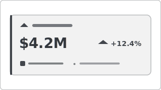

# Recipe: Advance Card (Rich KPI)

> **Preview:** [](../../assets/chart-previews/advance-card.svg)

- **id:** `advance-card`
- **Visual type:** `advanceCardE03760C5AB684758B56AA29F9E6C257B` ★ (custom visual)
- **Typical size:** 320 × 160

---

## Composition

```
┌──────────────────────────────────┐
│ ◆ Revenue                         │
│                                    │
│ $4.2M      ▲ 12.4% vs LY           │
│                                    │
│ ⚑ On Target  ·  Refreshed 5m ago   │
└──────────────────────────────────┘
```

Richer alternative to the built-in `card` — conditional colors, icons,
multiple rows of context, custom formatting per zone.

---

## Slots

| Slot | Purpose | Binding example |
|---|---|---|
| Value | Primary measure | `[Revenue]` |
| Delta | Secondary measure | `[YoY %]` |
| Status | Threshold indicator | `[Status]` (good/warn/bad) |
| Postfix | Unit / context string | "vs LY" |
| Icon | Leading symbol | Domain icon (SVG or emoji) |

---

## Formatting (theme-aware)

- **Background:** `background` (flat) OR `background2` (subtle lift)
- **Value color:** `foreground`
- **Delta color:** conditional — `good`/`bad`/`neutral`
- **Status icon:** `good`/`bad`/`neutral` glyph
- **Border:** 1px `secondary` OR left accent bar 3px `data0`

---

## Narrative frame by style

| Style | Configuration |
|---|---|
| Executive | Hero card, large value (32pt), minimal zones |
| Analytical | All zones populated, tooltip verbose |
| Operational | Status glyph dominant, background tinted by status |

---

## Do-NOT list

- ❌ Cramming > 3 informational zones (readers lose the hero number)
- ❌ Using when `kpi-banner` suffices (adds formatting complexity with no gain)
- ❌ Uneven card heights in the same row
- ❌ Hard-coded hex colors — always theme tokens
- ❌ Using status icon without a defined threshold measure

---

## When to use vs `kpi-banner`

| Use | When |
|---|---|
| **Advance card** | Need conditional colors + icons + 3 zones; brand-critical polish |
| **KPI banner** | Standard card suffices; faster to maintain |

---

## Data quality gotchas

- Status measure must return an enumerated value (good/warn/bad) — document the
  threshold DAX
- Icon binding may require URL-encoded SVG or named glyph — test rendering
- Delta measure must handle null prior-period gracefully

---

## Checklist

- [ ] ≤ 3 informational zones populated
- [ ] Status thresholds documented in Design Spec
- [ ] All colors via theme tokens
- [ ] Card height matches siblings in the row
- [ ] Custom visual registered in `report.json`
- [ ] Recipe choice justified vs `kpi-banner`
