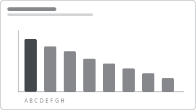

# Recipe: Categorical Comparison (Bar)

> **Preview:** [](../../assets/chart-previews/bar-comparison.svg)

- **id:** `bar-comparison`
- **Visual type:** `clusteredBar` (horizontal) OR `clusteredColumn` (vertical)
- **Typical size:** 536 × 384 (supporting slot in analytical layouts)

**Orientation rule:**
- **Horizontal bar** when category labels are long (> 8 chars) OR > 10 categories
- **Vertical column** when categories are short AND you want to imply time-order (months, quarters)

---

## Composition

```
Horizontal bar:                  Vertical column:
┌────────────────────────────┐   ┌────────────────────────────┐
│ Region A    ████████ $4.2M │   │  ▆▆▆▆                      │
│ Region B    █████    $2.8M │   │  ██▆▆  ▇▇                  │
│ Region C    ████     $2.1M │   │  ██▇▇  ██  ▆▆              │
│ Region D    ██▇     $1.3M  │   │   A    B   C   D            │
└────────────────────────────┘   └────────────────────────────┘
```

---

## Slots

| Slot | Purpose | Binding example |
|---|---|---|
| Category axis | Categorical dimension | `DimRegion[RegionName]` |
| Value axis | Primary measure | `[Total Revenue]` |
| Secondary series | (optional) comparison measure | `[Plan Revenue]` |
| Tooltip measures | Additional context on hover | `[YoY %]`, `[vs Plan %]` |

---

## Formatting (theme-aware)

- **Bar color:** `data0` for primary series, `data1` for secondary
  - **OR** — conditional color by measure (heatmap effect) for single-series ranking
- **Data labels:** ON, positioned outside, color `foreground`
- **Value axis:** hidden (labels make it redundant)
- **Category axis:** visible, 10pt Regular
- **Gridlines:** minor gridlines OFF, major gridlines muted

Conditional formatting recipe for "highlight one":
```json
"dataColors": [
  { "condition": "[Region] = 'North'", "color": "data0" },
  { "default": "neutral" }
]
```

---

## Narrative frame by style

| Style | Layout tweaks |
|---|---|
| Executive | Single-series, outside labels, one bar highlighted (accent color) to match the page's Big-Idea. Sort descending. |
| Analytical | Clustered 2-series (current vs plan OR current vs LY), both labeled. Sort by primary desc. |
| Operational | Horizontal bars with status-color backgrounds — green / amber / red by threshold. |

---

## Sorting

Default: sort descending by value. Rules:
- **Time categories** (months, quarters) → sort by natural time order, NOT by value
- **Categorical with alphabetical meaning** (product codes) → sort by value desc unless alphabetical has inherent meaning
- **Top-N + "Other"** → descending, with "Other" always last (regardless of its value)

---

## Top-N guidance

If category count > 10:
- Use TopN visual-level filter for top 10
- Optionally add "Other" bucket via DAX (`SWITCH(TRUE(), [Rank] <= 10, [Name], "Other")`)
- Document in Design Spec §5 which measures the Top-N is computed on

---

## Do-NOT list

- ❌ Stack columns to compare totals (clustered or 100%-stacked only; stacked obscures comparison)
- ❌ Use 3D bar / column ever
- ❌ Show > 20 bars in one visual — use drillthrough or horizontal scroll
- ❌ Truncate category labels without tooltip fallback
- ❌ Use rainbow palette (one color per bar) unless category is semantic (region = brand color)

---

## Data quality gotchas

- If measure returns negative values, labels may overlap axis line — verify in screenshot
- Empty categories show as gaps — filter out in visual-level filter if unwanted
- Category sort by measure locks when you sort — reset before publishing if needed

---

## Checklist

- [ ] Orientation (horizontal vs vertical) matches label length and count
- [ ] Sort order explicit (not default)
- [ ] Data labels ON with thousand separators + unit
- [ ] Axis title removed (redundant with visual title)
- [ ] Top-N filter applied when > 10 categories
- [ ] One accent color only when highlight pattern used
