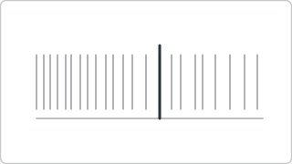

# Recipe: Barcode Plot (Deneb sibling)

> **Preview:** [](../../assets/chart-previews/barcode-plot.svg)

- **id:** `barcode-plot`
- **Visual type:** `Deneb6E97C82C58E5467CA7C3188B3E36ADE7` ★
- **Parent recipe:** [`deneb-custom.md`](deneb-custom.md)
- **Typical size:** 536 × 120

---

## Composition

```
┌────────────────────────────────────────┐
│  │  ││ │  │  ││ │  │  │  │  │  ║       │
│  └─ all individual values as vertical ticks │
│  (║ = highlighted value)                     │
└────────────────────────────────────────┘
```

All observations as thin vertical tick marks along a numeric axis. Highlights
specific values against the population.

---

## Slots

| Role | Binding example |
|---|---|
| Value axis | `[Order Value]` |
| Highlight (optional) | Selected value flag |

---

## Vega-Lite mark

```json
{ "mark": { "type": "tick", "thickness": 1, "size": 20 } }
```

Inherits scaffold from [`deneb-custom.md`](deneb-custom.md).

## Do-NOT list

- ❌ Heavy opacity (visually blocks)
- ❌ Adding data labels (defeats the density idea)
- ❌ Using for summary comparison (→ `bar-comparison`)
