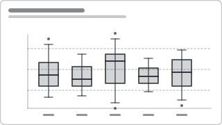

# Recipe: Box Plot (Quartile Distribution)

> **Preview:** [](../../assets/chart-previews/box-plot-distribution.svg)

- **id:** `box-plot-distribution`
- **Visual type:** Custom visual (`Box and Whisker`, `xViz Box Plot`) OR
  composed stacked-bar with whiskers
- **Typical size:** 480 × 320 (6-10 categories, horizontal OR vertical)

---

## Composition

```
          ┬   ┬        ┬       ┬
          │   │        │       │
         ┌┴┐ ┌┴┐ ┌──┐  │      ┌┴┐
 Region: │▓│ │▓│ │▓▓│  │      │▓│
         └┬┘ └┬┘ └──┘  │      └┬┘
          │   │    ·   │  ·    │
          ┴   ┴        ┴       ┴
         N  NE  S    W   E   Central
```

Each category: whiskers (min/max within 1.5·IQR), box (Q1–Q3), median line,
outliers plotted as dots beyond whiskers. Tells the full distribution story
— central tendency, spread, skew, and outliers — in one glyph.

---

## Slots

| Slot | Purpose | Binding example |
|---|---|---|
| Category | Group axis | `DimRegion[Region]` |
| Value | Distribution variable | `FactOrder[Order Value]` |
| Sampling | Row grain defining the distribution | line-item grain |
| Outlier threshold | Whisker rule (default 1.5·IQR) | visual setting |

---

## Formatting (theme-aware)

- Box fill: `neutral` 20% opacity; stroke: `foreground` 1.5 px
- Median line: `accent`, 2 px, full box width
- Whisker caps: `foreground` 1 px, short ticks (25% of box width)
- Outliers: `foreground` 60% opacity, 3 px radius dots
- Y axis: show value scale with 4-6 gridlines at `neutral` 15% opacity

---

## Do-NOT list

- ❌ Use for < 20 observations per category (shape is noise, use dot plot)
- ❌ Hide outliers (they ARE the story, not clutter)
- ❌ Colour boxes by category — kills comparability
- ❌ Combine with a bar chart of means on top (pick one)

---

## Checklist

- [ ] ≥ 20 observations per category
- [ ] Median line clearly distinguishable from box edges
- [ ] Outliers plotted, not clipped
- [ ] Axis starts at a meaningful floor (0 or domain min), not auto-fit
