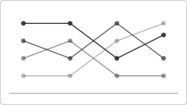

# Recipe: Bump Chart (Deneb sibling)

> **Preview:** [](../../assets/chart-previews/bump-chart.svg)

- **id:** `bump-chart`
- **Visual type:** `Deneb6E97C82C58E5467CA7C3188B3E36ADE7` ★
- **Parent recipe:** [`deneb-custom.md`](deneb-custom.md)
- **Typical size:** 824 × 400

---

## Composition

```
┌─────────────────────────────────────────────┐
│ 1  A ──── A ──── C ──── B                    │
│ 2  B ──╱──┼── B ────╱── A                    │
│ 3  C ──╲─ D ──╱── A ─╲── D                   │
│ 4  D ────  C ────── D ── C                   │
│    2021  2022  2023  2024                    │
└─────────────────────────────────────────────┘
```

Rank position on Y, time on X, one line per entity. Lines cross when ranks
swap. Shows rank movement across many periods.

---

## Slots

| Role | Binding example |
|---|---|
| X (time) | `DimDate[Year]` |
| Y (rank) | `RANKX([Revenue])` |
| Color (entity) | `DimProduct[ProductName]` |

---

## Vega-Lite marks

```json
{ "mark": { "type": "line", "strokeWidth": 2 } }
```

Add circle marks at each period for clarity.

Inherits scaffold from [`deneb-custom.md`](deneb-custom.md).

## Do-NOT list

- ❌ > 10 entities (visual tangles)
- ❌ 2 time periods only (→ `slope-chart`)
- ❌ Using when absolute value matters (→ `ribbon-chart`)
- ❌ Rainbow per-line colors; use ≤ 5 hues and group others
