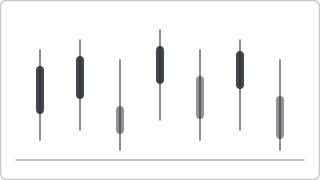

# Recipe: Candlestick (OHLC) (Deneb sibling)

> **Preview:** [](../../assets/chart-previews/candlestick-ohlc.svg)

- **id:** `candlestick-ohlc`
- **Visual type:** `Deneb6E97C82C58E5467CA7C3188B3E36ADE7` ★
- **Parent recipe:** [`deneb-custom.md`](deneb-custom.md)
- **Typical size:** 824 × 400

---

## Composition

```
┌────────────────────────────────────────┐
│    │    │                               │
│    █    ▇   │                           │
│    █    ▇   ▇    █                      │
│    █    ▇   ▇    █   │                  │
│    ▀    │   ▀    ▀   ▇                  │
│         │        │   ▇                  │
│  Mon  Tue  Wed  Thu  Fri                 │
│  ▀/▄ = open-close body                   │
│  │    = high-low wick                    │
└────────────────────────────────────────┘
```

Per-period OHLC (Open, High, Low, Close) glyph. Common in financial trading
and process-capability reviews.

---

## Slots

| Role | Binding example |
|---|---|
| Time | `DimDate[Date]` |
| Open | `[Open Price]` |
| High | `[High Price]` |
| Low | `[Low Price]` |
| Close | `[Close Price]` |

---

## Vega-Lite mark

```json
{ "mark": "rule" }  // wick
{ "mark": "bar" }   // body
```

Compose via Vega-Lite layers. Green (close > open) / red (close < open)
using `good` / `bad` theme tokens.

Inherits scaffold from [`deneb-custom.md`](deneb-custom.md).

## Do-NOT list

- ❌ Using for non-OHLC data (needs all 4 per period)
- ❌ Inverting green/red convention (confuses finance audience)
- ❌ > 90 periods visible (compress to weekly / monthly)
