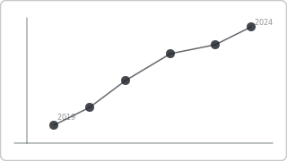

# Recipe: Connected Scatter (Play Axis)

> **Preview:** [](../../assets/chart-previews/connected-scatter.svg)

- **id:** `connected-scatter`
- **Visual type:** `scatterChart` with `playAxis23F08FF12F11460BB525B1A3ADED385C` ★ OR Play Axis field role
- **Typical size:** 600 × 480 (square aspect preferred)

---

## Composition

```
┌─────────────────────────────────────┐
│ ↑ Y: Margin %                        │
│ 50│      ●─●                         │
│   │     /   \                        │
│ 40│    ●     ●─●  (2024)             │
│   │   /                              │
│ 30│  ● (2022)                        │
│   │ /                                │
│ 20│●  (2020)                         │
│   └──────────────────────→  X: Revenue │
│        [▶ Play]   2020 → 2024        │
└─────────────────────────────────────┘
```

Scatter points connected by a path showing the evolution of an entity's
X/Y position over time. Play axis animates sequentially.

---

## Slots

| Slot | Purpose | Binding example |
|---|---|---|
| X axis | First measure | `[Revenue]` |
| Y axis | Second measure | `[Margin %]` |
| Play axis | Time | `DimDate[Year]` |
| Details | Entity identifier | `DimProduct[ProductName]` |
| Size (optional) | Third measure | `[Units]` |

---

## Formatting (theme-aware)

- **Point fill:** `data0`, size 8–12px
- **Path stroke:** `data0` at 60% opacity, 1.5px
- **Starting point:** smaller / muted; ending point: larger / labeled
- **Play controls:** default (Power BI built-in)
- **Tooltip:** show year / period per point

---

## Narrative frame by style

| Style | Configuration |
|---|---|
| Executive | ≤ 3 entities traced, final position labeled |
| Analytical | Up to 10 entities, colored by group, play axis on |
| Operational | Not recommended — animation doesn't suit monitoring |

---

## Do-NOT list

- ❌ > 10 entities (spaghetti) — use small multiples of this recipe
- ❌ Non-square aspect ratio (distorts path shape)
- ❌ Missing endpoint labels (viewer loses which point is "now")
- ❌ Using when only 2 time periods exist (→ `slope-chart`)
- ❌ Bubble size encoded as diameter (use area)

---

## Data quality gotchas

- Missing intermediate periods break the path continuity
- Entity identity must be stable across periods (same `DimProduct` key)
- Play axis respects page filters — document expected filter state
- Playback speed is per-user preference; design doesn't control it

---

## Checklist

- [ ] ≤ 10 entities
- [ ] Square aspect ratio
- [ ] First and last points labeled
- [ ] Time dimension has no gaps
- [ ] Play axis registered if using the Play Axis custom visual
- [ ] Tooltip shows period per point
