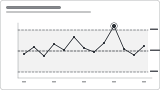

# Recipe: Control Chart (SPC — UCL / LCL / Mean)

> **Preview:** [](../../assets/chart-previews/control-chart-spc.svg)

- **id:** `control-chart-spc`
- **Visual type:** `lineChart` with reference lines OR custom `Control Chart`
  / `xViz SPC`
- **Typical size:** 640 × 320

---

## Composition

```
  ┌─────────────────────────────────── UCL
  │                       ●
  │                 ●           ●
  │─────●─────●──────────●──────── Mean
  │  ●       ●                 ●
  │             ●
  └─────────────────────────────────── LCL
     1   2   3   4   5   6   7   8
```

A time-ordered process metric with three reference lines: **mean** (centre),
**UCL** (mean + 3σ), **LCL** (mean − 3σ). Points outside the band, or the
Western Electric pattern rules (7 in a row one side of mean, 2 of 3 beyond
2σ, etc.), signal special-cause variation.

---

## Slots

| Slot | Purpose | Binding example |
|---|---|---|
| X axis | Sequence | `DimDate[Date]` (or run order) |
| Value | Process metric per sample | `[Defect Rate]` |
| Mean | Process centre | `[Process Mean]` (calculated) |
| UCL / LCL | ±3σ bounds | `[UCL]`, `[LCL]` (calculated) |
| Flag | Out-of-control marker | `[Is Out Of Control]` |

---

## Formatting (theme-aware)

- Series line: `foreground` 1.5 px with round markers
- Mean: dashed `accent` line, 1.5 px, labelled at right edge
- UCL / LCL: dashed `warning` lines, 1 px, labelled at right edge
- Out-of-control markers: solid `warning` fill, 5 px radius, tooltip with
  rule hit
- Subtle shaded band between UCL and LCL at `neutral` 6% opacity

---

## Do-NOT list

- ❌ Use for data without a stable sampling cadence (meaningless control limits)
- ❌ Hide the limits to "clean up" the chart — they ARE the chart
- ❌ Re-compute limits on every filter change — freeze to a baseline window
- ❌ Colour the whole series red after one breach — only flag the offending point

---

## Checklist

- [ ] Stable sampling cadence (same grain per point)
- [ ] Mean + UCL + LCL all visible and labelled
- [ ] Baseline window for limit calculation is explicit (tooltip / title)
- [ ] Out-of-control points are flagged, not the whole series
