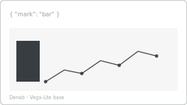

# Recipe: Deneb Custom Chart (Vega-Lite base)

> **Preview:** [](../../assets/chart-previews/deneb-custom.svg)

- **id:** `deneb-custom`
- **Visual type:** `Deneb6E97C82C58E5467CA7C3188B3E36ADE7` (custom visual)
- **Typical size:** variable — sized to slot; minimum 400 × 240

> **Base recipe.** All Deneb sibling recipes (`dot-plot`, `bump-chart`,
> `streamgraph`, `candlestick-ohlc`, `fan-chart-projection`, `voronoi-share`,
> `barcode-plot`, `dot-strip-plot`) inherit setup from this file and only
> document their unique Vega-Lite spec + anti-use.

---

## When to use Deneb

Deneb is the escape hatch when:
- No built-in visual or registered custom visual matches the FT vocabulary entry
- The report already registers Deneb (only pay the custom-visual cost once)
- The chart type is well-documented in Vega-Lite and the author can maintain the spec
- Interactive behavior (selection, brush, highlight) is needed beyond built-in capability

Do **not** reach for Deneb when a built-in or registered custom visual would do.

---

## Composition

```
┌───────────────────────────────────────┐
│ <title handled by visual container>   │
│ ┌─────────────────────────────────┐   │
│ │                                 │   │
│ │    Vega-Lite spec renders here  │   │
│ │                                 │   │
│ │    (marks, encodings, scales)   │   │
│ │                                 │   │
│ └─────────────────────────────────┘   │
│ <legend handled by spec>              │
└───────────────────────────────────────┘
```

---

## Slots (query roles)

| Role | Purpose | Binding example |
|---|---|---|
| Values | Fields exposed to Vega-Lite as `dataset` | dimension + measure set per sibling recipe |
| Category | Optional color / facet grouping | `DimSegment[SegmentName]` |

Each sibling recipe lists its specific role bindings.

---

## Vega-Lite scaffold (shared)

```json
{
  "$schema": "https://vega.github.io/schema/vega-lite/v5.json",
  "background": "transparent",
  "config": {
    "font": "Segoe UI",
    "axis": { "labelColor": "{{foreground}}", "titleColor": "{{foreground}}", "grid": false },
    "view": { "stroke": "transparent" }
  },
  "data": { "name": "dataset" },
  "mark": { /* sibling-specific */ },
  "encoding": { /* sibling-specific */ }
}
```

**Theme token substitution.** Replace `{{foreground}}`, `{{background}}`,
`{{data0}}…{{dataN}}`, `{{good}}`, `{{bad}}` with the active theme's resolved
hex values before writing the spec into `visual.json`. Never hard-code hex in
the published spec.

---

## Formatting (theme-aware)

- **Background:** `"background": "transparent"` (always) — lets the page
  background show through and avoids double borders
- **Typography:** `"config.font": "Segoe UI"` (matches report typography scale)
- **Grid:** disabled by default; re-enable per sibling if the chart requires it
- **Colors:** bind encoding ranges to theme `data0…dataN` tokens, not hex
- **Tooltip:** enable `"tooltip": true` unless the sibling recipe disables it

---

## Narrative frame by style

| Style | Spec posture |
|---|---|
| Executive | Single mark, single accent color, no legend when only one series |
| Analytical | Multi-mark composition allowed, legend on, tooltip verbose |
| Operational | Bold single accent, large fonts (≥ 12pt), no brushing |

---

## Do-NOT list

- ❌ Hard-code hex colors in the published spec — use theme tokens
- ❌ Embed data directly in the spec (`"data": { "values": [...] }`) — breaks
  data refresh; always use `{ "name": "dataset" }`
- ❌ Ship rainbow categorical scales (> 5 hues)
- ❌ Use 3D projections or perspective transforms
- ❌ Ship a spec that fails Deneb's JSON schema validation
- ❌ Use Deneb when a built-in visual would render the same chart

---

## Data quality gotchas

- Deneb receives data as rows, one per aggregated record; spec must handle
  empty datasets (`BLANK` → no marks) gracefully
- Field names in the spec must match the Values role order (Deneb exposes
  `__0`, `__1`, … by default) — **always** use `dataset.field()` aliasing in
  the spec template
- Interactive selections inside Deneb do **not** cross-filter other visuals
  unless the spec explicitly emits Power BI selection events

---

## Checklist

- [ ] Custom visual registered in `report.json` → `publicCustomVisuals`
- [ ] Spec validated against Vega-Lite v5 schema
- [ ] All colors resolve to theme tokens, no literal hex
- [ ] Background transparent
- [ ] Tooltip role populated with human-readable field names
- [ ] Sibling recipe id and chart name documented in visual title
- [ ] Design Spec §11 justifies why Deneb over a built-in alternative
