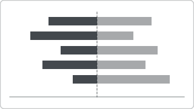

# Recipe: Diverging Likert Scale

> **Preview:** [](../../assets/chart-previews/diverging-likert.svg)

- **id:** `diverging-likert`
- **Visual type:** `barChart` 100% stacked, split at neutral point
- **Typical size:** 536 × 384

---

## Composition

```
┌───────────────────────────────────────────────┐
│ Q1: Product quality                             │
│    ████▓▓|▒▒░░░      80% agree                  │
│ Q2: Pricing fairness                            │
│    ██▓▓▓▓|▒▒▒░░░     55% agree                  │
│ Q3: Support responsiveness                      │
│     █▓▓|▒▒▒▒▒▒░░░    30% agree                  │
│                                                   │
│ ████ Strongly Agree  ▓▓ Agree  ▒▒ Disagree  ░░ Strongly Disagree │
└───────────────────────────────────────────────┘
```

Centered on the neutral boundary; positive sentiment extends right, negative left.

---

## Slots

| Slot | Purpose | Binding example |
|---|---|---|
| Axis | Question / category | `FactSurvey[QuestionText]` |
| Legend | Likert levels (ordered) | `DimLikert[LevelName]` with `[LevelOrder]` sort |
| Values | Response count / % | `[Response %]` |

---

## Formatting (theme-aware)

- **Positive colors:** `good` (strongly agree) + lighter tint (agree)
- **Negative colors:** `bad` (strongly disagree) + lighter tint (disagree)
- **Neutral:** muted `neutral` OR excluded from the bar (shown as a separator)
- **Center line:** 1px `foreground` at the neutral boundary
- **Legend:** ordered left-to-right matching sentiment polarity
- **Data labels:** % agree summary at right of each row

---

## Narrative frame by style

| Style | Configuration |
|---|---|
| Executive | Top 3 questions only, summary % agree as the headline |
| Analytical | All questions, segment panel filter for demographic breakdowns |
| Operational | Threshold markers on % agree (red if < 60%) |

---

## Do-NOT list

- ❌ More than 5 Likert levels (6+ scales become unreadable)
- ❌ Including neutral in the stack (destroys the center anchor — show separately)
- ❌ Unordered legend (loses the diverging story)
- ❌ Rainbow palette instead of polar (good/bad) palette
- ❌ Raw counts when questions have unequal response rates — use %

---

## Data quality gotchas

- Likert level ordering must be set via a sort-by column in the semantic model
- Unequal response rates across questions skew raw counts — always use %
- "No response" must be filtered out or it silently becomes part of the stack

---

## Checklist

- [ ] 4 or 5 Likert levels (not 6+)
- [ ] Neutral handled explicitly (separator or excluded)
- [ ] Ordering enforced via sort-by column
- [ ] Palette is polar (good ↔ bad), not rainbow
- [ ] Summary % agree label at row end
- [ ] "No response" filtered out
