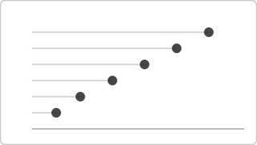

# Recipe: Dot Plot (Deneb sibling)

> **Preview:** [](../../assets/chart-previews/dot-plot.svg)

- **id:** `dot-plot`
- **Visual type:** `Deneb6E97C82C58E5467CA7C3188B3E36ADE7` ★
- **Parent recipe:** [`deneb-custom.md`](deneb-custom.md)
- **Typical size:** 536 × 320

---

## Composition

```
┌────────────────────────────────────────┐
│ Region A                   ●             │
│ Region B               ●                 │
│ Region C          ●                      │
│ Region D      ●                          │
│ Region E  ●                              │
│            0k  20k  40k  60k  80k        │
└────────────────────────────────────────┘
```

Single-dot-per-category representation on a shared numeric axis. More ink-
efficient than bar charts when magnitude is the message but comparisons
need precise read.

---

## Slots

| Role | Binding example |
|---|---|
| Category axis | `DimRegion[RegionName]` |
| Value | `[Revenue]` |

---

## Vega-Lite mark

```json
{ "mark": { "type": "circle", "size": 120 } }
```

Inherits scaffold, theming, and do-NOT rules from
[`deneb-custom.md`](deneb-custom.md).

## Do-NOT list

- ❌ Multiple series overlapping (dots hide each other)
- ❌ > 20 categories (→ `dot-strip-plot`)
- ❌ Encoding dot size by a second measure without area scaling
