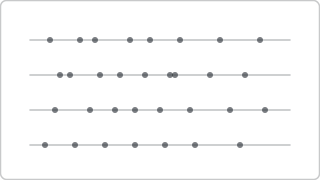

# Recipe: Dot Strip Plot (Deneb sibling)

> **Preview:** [](../../assets/chart-previews/dot-strip-plot.svg)

- **id:** `dot-strip-plot`
- **Visual type:** `Deneb6E97C82C58E5467CA7C3188B3E36ADE7` ★
- **Parent recipe:** [`deneb-custom.md`](deneb-custom.md)
- **Typical size:** 536 × 320

---

## Composition

```
┌────────────────────────────────────────┐
│ North   ● ●  ●● ● ●  ●                  │
│ East    ●● ●● ●●● ●                      │
│ South   ● ●  ● ●  ● ●  ●                 │
│ West    ●  ●● ●●  ●                      │
│         0      25     50     75    100   │
└────────────────────────────────────────┘
```

One dot per observation along a numeric strip, grouped by category. Shows
individual values and spread simultaneously.

---

## Slots

| Role | Binding example |
|---|---|
| Category (strip) | `DimRegion[RegionName]` |
| Value (position on strip) | `[Order Value]` |

---

## Vega-Lite mark

```json
{ "mark": { "type": "circle", "size": 60, "opacity": 0.5 } }
```

Use jitter or `fillOpacity` to handle overplotting.

Inherits scaffold from [`deneb-custom.md`](deneb-custom.md).

## Do-NOT list

- ❌ Opaque dots at high density (overplotting hidden)
- ❌ Using when summary stats matter more (→ `box-plot-distribution`)
- ❌ > 500 observations per strip without alpha blending
