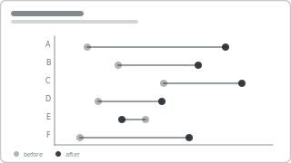

# Recipe: Dumbbell (Before vs After)

> **Preview:** [](../../assets/chart-previews/dumbbell-change.svg)

- **id:** `dumbbell-change`
- **Visual type:** Custom visual (`Dumbbell Bar Chart` / `xViz`) OR composed
  `scatterChart` + error-bar shapes
- **Typical size:** 536 × 384

---

## Composition

```
A  ○───────────────●
B     ○───────●
C          ○──────────●
D  ○────●
E       ●───○        (regressed)
F  ○──────────●
   before    after
```

Two points per category connected by a line. Clearest single visual for
**before-vs-after**, **plan-vs-actual**, or **regional spread of min-vs-max**.

---

## Slots

| Slot | Purpose | Binding example |
|---|---|---|
| Category | Entity | `DimStore[Store]` |
| Point A | Before measure | `[Revenue LY]` |
| Point B | After measure | `[Revenue CY]` |
| Connector | Auto (line A→B) | — |

---

## Formatting (theme-aware)

- **Before dot:** `neutral` or `foreground` at 50% opacity
- **After dot:** `accent` at 100%
- **Connector line:** `foreground` at 30-40% opacity
- **Sort:** by absolute change DESC (biggest movers on top)

Emphasis rules:
- Rows that *regressed* (after < before) → connector + after-dot in `bad`
- Rows that improved by > threshold → connector + after-dot in `good`

---

## Do-NOT list

- ❌ Use for > 12 categories (line tangles) — switch to `slope-chart` per
  segment or small-multiples
- ❌ Use when A and B are *time series* (plot over time — use `trend-line`)
- ❌ Skip the connector line (two dots alone look like a scatter plot)

---

## Checklist

- [ ] Before dot is clearly neutral / smaller than after
- [ ] Connector line present, thinner than dots
- [ ] Sort by absolute Δ DESC
- [ ] Regressed rows visually distinct (color or shape)
