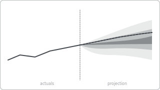

# Recipe: Fan Chart / Projection (Deneb sibling)

> **Preview:** [](../../assets/chart-previews/fan-chart-projection.svg)

- **id:** `fan-chart-projection`
- **Visual type:** `Deneb6E97C82C58E5467CA7C3188B3E36ADE7` ★
- **Parent recipe:** [`deneb-custom.md`](deneb-custom.md)
- **Typical size:** 824 × 400

---

## Composition

```
┌────────────────────────────────────────┐
│                       ░░░░░░░░░░         │
│                   ░░░░▒▒▒▒▒▒▒▒░░░░      │
│         ▁▃▅▇██▇▅▃▅▇▓▓▒▒▒▒▒▒▒▒▓▓▇▅▃▅     │
│                   ░░░░▒▒▒▒▒▒▒▒░░░░      │
│                       ░░░░░░░░░░         │
│       (actuals)  │  (projection)        │
└────────────────────────────────────────┘
```

Central trend line flanked by widening confidence bands. Communicates
growing uncertainty in forecasts.

---

## Slots

| Role | Binding example |
|---|---|
| Time | `DimDate[Date]` |
| Central value | `[Forecast]` |
| Lower CI bands | `[Forecast - 1σ]`, `[Forecast - 2σ]` |
| Upper CI bands | `[Forecast + 1σ]`, `[Forecast + 2σ]` |

---

## Vega-Lite marks

```json
{ "mark": "area" }  // CI bands, layered with lower opacity farther out
{ "mark": "line" }  // central forecast
```

Inherits scaffold from [`deneb-custom.md`](deneb-custom.md).

## Do-NOT list

- ❌ Missing the "actual vs projection" split indicator
- ❌ Symmetric CI when the measure has a natural floor (zero)
- ❌ > 3 confidence bands (clutter)
- ❌ Rainbow band colors (use opacity tints of one hue)
