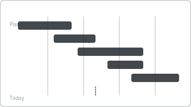

# Recipe: Gantt Timeline

> **Preview:** [](../../assets/chart-previews/gantt-timeline.svg)

- **id:** `gantt-timeline`
- **Visual type:** `Gantt1467746032498` ★ (custom visual)
- **Typical size:** 824 × 480

---

## Composition

```
┌─────────────────────────────────────────────────┐
│ Task                Jan  Feb  Mar  Apr  May  Jun  │
│ Discovery          ████                            │
│ Design              ████████                       │
│ Build                  ████████████                │
│ Test                          ██████               │
│ Launch                               ████          │
│                                      ♦ Milestone   │
└─────────────────────────────────────────────────┘
```

Horizontal bars timed along a date axis. Optional milestones, dependencies,
% complete progress bars.

---

## Slots

| Slot | Purpose | Binding example |
|---|---|---|
| Legend | Task category | `DimTask[Phase]` |
| Task | Task name | `DimTask[TaskName]` |
| Start Date | Task start | `FactTask[StartDate]` |
| End Date | Task end | `FactTask[EndDate]` |
| % Complete | Progress indicator | `[Percent Complete]` |
| Resource | Assigned owner | `DimResource[OwnerName]` |

---

## Formatting (theme-aware)

- **Bar color:** `data0…dataN` by phase
- **Progress overlay:** `data0` at 100%, bar at 40%
- **Milestone marker:** diamond glyph, `data1`
- **Today line:** 1px `foreground` vertical
- **Row height:** 24px per task
- **Date header:** `foreground` 10pt

---

## Narrative frame by style

| Style | Configuration |
|---|---|
| Executive | ≤ 12 tasks, phases grouped, milestones prominent |
| Analytical | Full task list, resource coloring, dependencies visible |
| Operational | Today line + status coloring (on-track / slipping / blocked) |

---

## Do-NOT list

- ❌ > 30 tasks visible (scroll is acceptable; cramming is not)
- ❌ Missing today line (users lose temporal orientation)
- ❌ Tasks without defined end dates (render as indefinite bars)
- ❌ Color-coding by resource AND phase simultaneously (pick one)
- ❌ Using for non-temporal ordered activities (→ `funnel-conversion`)

---

## Data quality gotchas

- Overlapping tasks per owner are valid but can look like errors — tooltip should clarify
- End date before start date creates invisible / reversed bars — validate at ETL
- Time zones: store all dates as UTC in the fact; convert at visualization
- Milestones need a zero-duration task (start = end) — custom visual may require explicit flag

---

## Checklist

- [ ] All tasks have start AND end dates
- [ ] Today line visible
- [ ] Phase / status color scheme picked (one encoding only)
- [ ] Milestones differentiated from task bars
- [ ] Custom visual registered in `report.json`
- [ ] Sort order deliberate (by start date asc, or WBS order)
