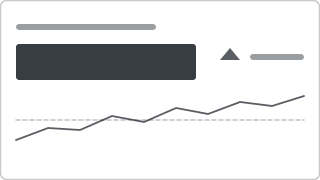

# Recipe: KPI Indicator (Built-in KPI Visual)

> **Preview:** [](../../assets/chart-previews/kpi-indicator.svg)

- **id:** `kpi-indicator`
- **Visual type:** `kpi`
- **Typical size:** 320 × 160

---

## Composition

```
┌──────────────────────────────────┐
│ Revenue                          │
│                                  │
│   $4.2M        ▲  Good           │
│                                  │
│  ▂▃▅▆▇█  (trend axis)            │
│                                  │
│ Goal: $4.0M  |  +5.0% vs goal    │
└──────────────────────────────────┘
```

---

## Slots

| Slot | Purpose | Binding example |
|---|---|---|
| Indicator | Primary measure | `[Total Revenue]` |
| Trend axis | Time dimension | `DimDate[Month]` |
| Target goal | Target measure | `[Revenue Plan]` |

---

## Formatting (theme-aware)

- **Indicator good:** `good` semantic token
- **Indicator bad:** `bad` semantic token
- **Indicator neutral:** `neutral` semantic token
- **Trend line:** `foreground` muted 40%
- **Goal line:** `foreground` dashed 1px
- **Direction rule:** explicit — "High is good" or "Low is good" (latency case)

---

## Narrative frame by style

| Style | Configuration |
|---|---|
| Executive | Large indicator, trend visible, goal line subtle |
| Analytical | Full trend axis, goal + tolerance bands, tooltip verbose |
| Operational | Max indicator color contrast, trend axis compressed |

---

## Do-NOT list

- ❌ Using without a target goal — `kpi-banner` is clearer for bare metrics
- ❌ "High is good" for metrics where low is good (defects, latency) without explicit direction flip
- ❌ Trend axis with < 6 data points — looks jagged, use card with delta
- ❌ Multiple KPIs on one visual (use 3–6 `kpi-indicator` side-by-side)

---

## Data quality gotchas

- Goal measure must be at the same grain as the indicator (same filters apply)
- Trend axis must be contiguous — gaps in time cause visual jumps
- Semantic color fires on goal-vs-indicator comparison, not on trend direction

---

## Checklist

- [ ] Goal measure defined and documented
- [ ] High-is-good vs low-is-good direction set
- [ ] Trend axis has ≥ 6 points
- [ ] Indicator color uses semantic tokens (`good`/`bad`/`neutral`)
- [ ] Comparison vs goal visible as delta
