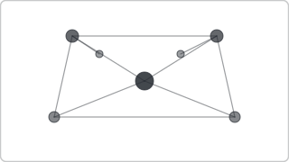

# Recipe: Network Graph

> **Preview:** [](../../assets/chart-previews/network-graph.svg)

- **id:** `network-graph`
- **Visual type:** `ForceGraph1438016029256` ★ (custom visual)
- **Typical size:** 824 × 560

---

## Composition

```
         ┌──── A ────┐
        /    │       \
       B     │        C
       │     D        │
       └───  │  ──────┘
            E
```

Nodes + edges with force-directed layout. Good for showing complex
relationships, weak for quantitative comparison.

---

## Slots

| Slot | Purpose | Binding example |
|---|---|---|
| Source | Edge source node | `FactRelation[Source]` |
| Target | Edge target node | `FactRelation[Target]` |
| Edge weight | Tie strength | `[RelationshipStrength]` |
| Node size | Node importance | `[NodeDegree]` |

---

## Formatting (theme-aware)

- **Node fill:** `data0…dataN` by community / group
- **Edge stroke:** `foreground` 20% opacity, thickness ∝ weight
- **Labels:** 9pt, on high-degree nodes only
- **Background:** transparent

---

## Narrative frame by style

| Style | Configuration |
|---|---|
| Executive | Rarely — graph visuals rarely produce clear takeaways |
| Analytical | Interactive exploration, filter by community |
| Operational | Not recommended |

---

## Do-NOT list

- ❌ > 100 nodes (hairball)
- ❌ Rendering all node labels (impossible to read)
- ❌ Using when a hierarchy exists (→ `sunburst` or tree)
- ❌ Expecting users to read edge weights precisely (graphs are qualitative)
- ❌ Skipping layout stabilization (animated jitter distracts)

---

## Data quality gotchas

- Disconnected components float independently — verify desired
- Self-loops render as curves back to the source; exclude unless meaningful
- Duplicate edges accumulate weight silently — aggregate at ETL
- Force layout is non-deterministic — same data may visually differ on refresh

---

## Checklist

- [ ] ≤ 100 nodes (or filter by centrality / community)
- [ ] Labels only on hub nodes
- [ ] Community / group coloring uses ≤ 5 hues
- [ ] Edge weights tied to a validated measure
- [ ] Custom visual registered in `report.json`
- [ ] Alternative visual considered first (this is a last-resort pick)
