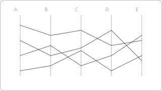

# Recipe: Parallel Coordinates

> **Preview:** [](../../assets/chart-previews/parallel-coordinates.svg)

- **id:** `parallel-coordinates`
- **Visual type:** `PBI_CV_9D24DAC5_8DAD_4E53_971F_5112EB5A3C35` ★ (custom visual) OR Deneb
- **Typical size:** 824 × 480

---

## Composition

```
┌────────────────────────────────────────────┐
│  Price   Quality  Speed  Support  Value      │
│  ├─       ├─      ├─     ├─       ├─          │
│  ──────●──●───────●──────●────────●───        │
│  ──────●─────●────●─────●────────●──          │
│  ──────●────●─────●────●───────●───           │
│  ─────●──●────────●──────●────●──             │
└────────────────────────────────────────────┘
```

Multiple vertical axes (each = one attribute) with a polyline per entity
crossing all axes. Reveals multi-attribute patterns and clusters.

---

## Slots

| Slot | Purpose | Binding example |
|---|---|---|
| Entity | One polyline per row | `DimProduct[ProductName]` |
| Attribute axes | Normalized measures | `[Price]`, `[Quality]`, `[Speed]`, `[Support]`, `[Value]` |

---

## Formatting (theme-aware)

- **Polyline stroke:** `data0` at 30% opacity, 1px
- **Highlighted polyline:** `data0` at 100%, 2px
- **Axes:** `foreground` 20% opacity
- **Axis labels:** 10pt, at top of each vertical axis

---

## Narrative frame by style

| Style | Configuration |
|---|---|
| Executive | Rarely — multi-axis reads are analytical by nature |
| Analytical | Default — brush-to-filter, color by cluster |
| Operational | Not recommended |

---

## Do-NOT list

- ❌ > 8 attribute axes (lines overlap too densely)
- ❌ > 200 entities without alpha blending (occlusion)
- ❌ Unordered axes (ordering changes pattern readability — rearrange deliberately)
- ❌ Mixed scales per axis (always normalize)
- ❌ Rainbow per-polyline colors (cluster color or single-hue tint)

---

## Data quality gotchas

- Nulls in any attribute break that row's polyline — backfill or filter
- Axis ordering matters: put correlated attributes adjacent to surface patterns
- Interactive brushing requires the visual to expose selection to Power BI

---

## Checklist

- [ ] ≤ 8 attribute axes
- [ ] All attributes normalized to common scale
- [ ] Axis order deliberate
- [ ] Polyline alpha tuned for density
- [ ] Custom visual registered in `report.json`
