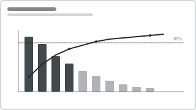

# Recipe: Pareto 80/20 (ABC Analysis)

> **Preview:** [](../../assets/chart-previews/pareto-80-20.svg)

- **id:** `pareto-80-20`
- **Visual type:** `lineClusteredColumnCombo` (column + line secondary axis)
- **Typical size:** 640 × 400

---

## Composition

```
   ▇                                       100% ───────╮
   ▇  ▇                                               /
   ▇  ▇  ▇                              ◄─────── 80%  /
   ▇  ▇  ▇  ▇                                       /
   ▇  ▇  ▇  ▇  ▇                                   /
   ▇  ▇  ▇  ▇  ▇  ▇  ▇  ▇  ▇  ▇                  /
   A  B  C  D  E  F  G  H  I  J
           ↑
       A, B, C = 80% of value (vital few)
```

Columns sorted descending, overlaid line shows **cumulative %**. A reference
line at 80% makes the "vital few" categories obvious.

---

## Slots

| Slot | Purpose | Binding example |
|---|---|---|
| Shared axis | Entity sorted by value DESC | `DimSKU[SKU]` |
| Column values | Primary measure | `[Revenue]` |
| Line values | Cumulative % | `[Revenue Cumulative %]` |
| Reference line | 80% horizontal | constant |

---

## DAX (cumulative %)

```dax
Revenue Cumulative % =
VAR CurrentRank = RANKX(ALLSELECTED(DimSKU[SKU]), [Revenue])
VAR CumulativeValue =
    CALCULATE(
        [Revenue],
        TOPN(CurrentRank, ALLSELECTED(DimSKU[SKU]), [Revenue])
    )
VAR Total = CALCULATE([Revenue], ALLSELECTED(DimSKU[SKU]))
RETURN DIVIDE(CumulativeValue, Total)
```

---

## Formatting (theme-aware)

- **Columns:** `data0`, with bars ABOVE the 80% cumulative point rendered in
  `foreground` (accent), bars BELOW in neutral (Analytical A/B/C emphasis)
- **Line:** `accent` on secondary axis 0-100%
- **Reference line:** 80% horizontal, dashed, labelled "80% (vital few)"

---

## Do-NOT list

- ❌ Include a remainder / "Other" bucket — defeats the purpose
- ❌ Not sort DESC — the cumulative line stops being monotone
- ❌ Mix two cumulative measures — one line only

---

## Checklist

- [ ] Columns sorted by value DESC (not alphabetical)
- [ ] Cumulative % line on secondary axis, 0-100 scale
- [ ] 80% reference line rendered + labelled
- [ ] A / B / C tier callout in the visual title or annotation
