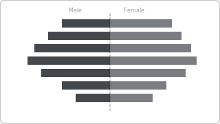

# Recipe: Population Pyramid

> **Preview:** [](../../assets/chart-previews/population-pyramid.svg)

- **id:** `population-pyramid`
- **Visual type:** `clusteredBarChart` split by sign (back-to-back) OR `TornadoChart1452517688218` ★
- **Typical size:** 560 × 480

---

## Composition

```
┌──────────────────────────────────────────┐
│         Male           │        Female     │
│ 75+     ██             │  ██                │
│ 65-74   ████           │  ████              │
│ 55-64   ██████         │  ██████            │
│ 45-54   ████████       │  ████████          │
│ 35-44   ██████████     │  ██████████        │
│ 25-34   ████████████   │  ████████████      │
│ 15-24   ██████████     │  ██████████        │
│  0-14   ████████       │  ████████          │
│      0  1k  2k  3k     0  1k  2k  3k        │
└──────────────────────────────────────────┘
```

Back-to-back horizontal bars where each side is a demographic group (sex,
cohort, segment). Age bands on a shared Y axis.

---

## Slots

| Slot | Purpose | Binding example |
|---|---|---|
| Axis | Ordinal group dimension | `DimDemographic[AgeBand]` |
| Group A | Left-side category | `FactCensus[Male Count]` |
| Group B | Right-side category | `FactCensus[Female Count]` |

---

## Formatting (theme-aware)

- **Left side:** `data0` (men) OR semantic tone
- **Right side:** `data1` (women) OR contrasting tone
- **Axis labels:** centered between sides, 10pt
- **Data labels:** absolute counts at bar end (both sides)
- **Center gutter:** 48px for age-band labels

---

## Narrative frame by style

| Style | Configuration |
|---|---|
| Executive | Single timepoint, annotated inflection age band |
| Analytical | Small multiples across years, showing cohort aging |
| Operational | Rarely — demographic context is strategic, not operational |

---

## Do-NOT list

- ❌ More than 2 groups (diverging bars only compare 2 sides)
- ❌ Age bands unordered (must be natural age order)
- ❌ Labels crammed inside bars (use outside labels)
- ❌ Asymmetric scales between sides (distorts comparison)
- ❌ Using for non-demographic symmetric A/B (→ `tornado-chart`)

---

## When to use vs `tornado-chart`

| Use | When |
|---|---|
| **Population pyramid** | Ordered ordinal group (age, cohort); demographic story |
| **Tornado chart** | Ranked drivers / sensitivity analysis; no inherent ordering |

---

## Data quality gotchas

- Age band widths must be equal (5-year or 10-year consistent)
- Group A and Group B measures must use matching filter context
- "Unknown" sex / demographic category needs explicit handling (filter out or show separately)
- X-axis auto-range per side may scale differently — lock to symmetric range

---

## Checklist

- [ ] Age / cohort bands equal width
- [ ] Symmetric X-axis scale
- [ ] Both sides labeled at bar ends
- [ ] Unknown / null demographic handled
- [ ] Recipe choice justified vs `tornado-chart`
