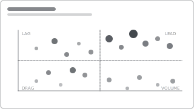

# Recipe: Scatter Quadrant

> **Preview:** [](../../assets/chart-previews/scatter-quadrant.svg)

- **id:** `scatter-quadrant`
- **Visual type:** `scatterChart`
- **Typical size:** 560 × 440

---

## Composition

```
       high │                  ●            ●           │
     Margin │    ● (invest)           ●  (cash cow)    │
            │               ●       ●●                 │
            ├─────────────────────────────────────────  │ ◄ median line
            │   ●                     ●                 │
            │      (divest)    ●         (maintain)    │
        low │      ●●                                   │
            └─────────────────────────────────────────  │
              low          Volume             high
                           ▲ median
```

Two numeric measures on X and Y, one dimension as the mark, optional third measure as bubble size,
optional fourth as color. Median reference lines split the canvas into four actionable quadrants.

---

## Slots

| Slot | Content | Binding example |
|---|---|---|
| X axis | Numeric measure | `[Volume]` or `[Market Share]` |
| Y axis | Numeric measure | `[Margin %]` or `[Growth Rate]` |
| Details | Entity dimension | `Product.ProductName` (10-50 points) |
| Size *(optional)* | Third measure | `[Revenue]` |
| Legend *(optional)* | Category | `Product.Category` (max 5 colors) |
| Reference lines | Median X + median Y | Constant or measure-driven |

---

## Formatting (theme-aware)

- **Marker color:** `data0` if no legend; theme `data0..dataN` if category legend used
- **Marker size:** 6-12pt if no Size measure; area-scaled if Size is bound
- **Reference lines:** median X + median Y in `neutral` dashed, 1pt
- **Quadrant labels:** add textbox annotations naming each quadrant (Invest / Cash Cow / Divest / Maintain)
- **Axis labels:** both must show the measure name AND units
- **Data labels:** only on the top-N outliers (conditional format) — labeling all 50 points is chaos

---

## Narrative frame

- **Executive:** label each quadrant with an action verb; highlight 2-3 top outliers with annotations
- **Analytical:** primary use case; pair with a sortable table of the same entities
- **Operational:** avoid — scatter is exploratory, not a dashboard pattern

---

## Do NOT

- Use a scatter for **< 10 data points** (too sparse — use a table)
- Use a scatter for **> 200 points** without categorical color or aggregation — overplotting
- Use **bubble radius** proportional to the measure (viewers see area) — let Power BI area-scale
- Use scatter for **time series** (use trend-line; scatter has no time order)
- Put **nominal categories** on a numeric axis (Product is nominal, not a number)

---

## Data quality gotchas

- **Outliers dominate scale:** a single 10×-larger bubble flattens everyone. Consider log axis or clipping outliers into a separate callout.
- **Correlation ≠ causation:** a scatter showing X and Y correlated doesn't mean one drives the other. Use language carefully in titles.
- **Missing values:** entities with null X or Y silently drop off — check row count before and after binding
- **Quadrant boundaries** move when filters change — if using dynamic median lines, document the scoping

---

## Checklist

- [ ] 10-200 points after filtering
- [ ] Both axes labeled with measure + units
- [ ] Median reference lines in `neutral` dashed
- [ ] Quadrant textbox annotations with action verbs
- [ ] Top-N outliers have data labels; others don't
- [ ] Bubble sizing area-scaled (Power BI default)
- [ ] Alt text: "Scatter plot of <X> vs <Y> for <N> <entities>, <outlier count> in upper-right quadrant"
