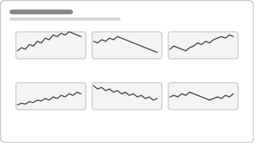

# Recipe: Small Multiples Trend

> **Preview:** [](../../assets/chart-previews/small-multiples-trend.svg)

- **id:** `small-multiples-trend`
- **Visual type:** `lineChart` with **Small multiples** field set
- **Typical size:** 960 × 480 (full-width). Each panel ≈ 200 × 140 at 3×2 grid.

---

## Composition

```
┌──── Region A ────┐  ┌──── Region B ────┐  ┌──── Region C ────┐
│     ╱╲    ╱\     │  │  ╱╲      ╱\      │  │      ╱\  ╱\      │
│   ╱    ╲╱   ╲    │  │ ╱  ╲    ╱  ╲___  │  │   ╱\╱   ╲╱   ╲   │
│ ╱         ...    │  │╱    ╲__╱         │  │  ╱               │
│ J F M A M J J A  │  │ J F M A M J J A  │  │ J F M A M J J A  │
└──────────────────┘  └──────────────────┘  └──────────────────┘
┌──── Region D ────┐  ┌──── Region E ────┐  ┌──── Region F ────┐
│  ...             │  │  ...             │  │  ...             │
└──────────────────┘  └──────────────────┘  └──────────────────┘
```

Use when **> 4 series** would otherwise clutter a single line chart. One series per panel;
shared axis scale so panels are visually comparable.

---

## Slots

| Slot | Content | Binding example |
|---|---|---|
| Small multiples | Splitting dimension | `Region.RegionName` (capped at 12 panels) |
| X-axis | Time | `Date.YearMonth` or `Date.FiscalMonth` |
| Y-axis | Measure | `[Revenue]` |
| Series *(optional)* | Compare within panel | `Period.PeriodType` (e.g., CY vs PY) — **max 2** |

---

## Formatting (theme-aware)

- **Shared Y-axis:** ON (default) — essential for cross-panel comparison
- **Shared X-axis:** ON
- **Grid layout:** 3 × 2 (6 panels) or 4 × 3 (12 panels). More than 12 → switch to matrix
  with sparkline column (`matrix-scorecard`).
- **Panel title:** each panel auto-titled with category value — 10pt Segoe UI
- **Line color:** single `data0` token across all panels (variation comes from data, not color)
- **Markers:** off (too noisy at small size)
- **Axis labels:** minimal — just min + max on Y, first + last on X

---

## Narrative frame

- **Executive:** rarely used — switch to single-line chart with Top 3 + "Other" bucket
- **Analytical:** primary use case — annotate 1-2 panels with a callout or reference line
  in a contrast color (`neutral`) to draw the eye
- **Operational:** color panels with a status threshold — panels below target get a subtle
  `bad`-tint background fill

---

## Do NOT

- Use independent Y-axes — breaks comparability and misleads viewers
- Exceed **12 panels** — scanning burden explodes
- Use > 2 series inside a panel — pick single-series small multiples OR dual-series comparison, not both
- Add legends *inside* each panel — put one shared legend above the grid
- Apply different colors per panel (rainbow) — one color for all

---

## Data quality gotchas

- **Equal time range:** all panels must span the same date range; blank periods for a slow
  panel should render as flat-line, not compress the X-axis
- **Outlier panel:** a single panel with 10× the scale of the others will flatten everyone
  else — flag in Design Spec §5 and decide: log scale, remove outlier, or use multi-plot
- **Category cap:** if source data has > 12 categories, apply a TOP N filter and put "Other"
  in its own panel (do NOT silently drop categories)

---

## Checklist

- [ ] Panel count ≤ 12
- [ ] Shared X + Y axes
- [ ] Single line color (`data0`) across all panels
- [ ] Panel titles readable (category name + value optional)
- [ ] Markers off unless values are very sparse
- [ ] TOP N + Other fallback if source has > 12 categories
- [ ] Alt text: "Small multiples of <measure> by <dimension>, <N> panels"
