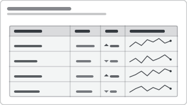

# Recipe: Sparkline Table (Row-wise Micro-trends)

> **Preview:** [](../../assets/chart-previews/sparkline-table.svg)

- **id:** `sparkline-table`
- **Visual type:** `tableEx` / matrix with inline line sparkline column (core
  visual) OR table + custom `Sparkline` visual
- **Typical size:** 720 × 360 (full-width table, 8-12 rows)

---

## Composition

```
┌────────────┬────────┬───────┬──────────────┐
│ Product    │   YTD  │  Δ%   │  12-mo trend │
├────────────┼────────┼───────┼──────────────┤
│ Alpha      │  12.4M │ ▲ 8%  │   ╱‾‾╲ ╱‾    │
│ Bravo      │   9.1M │ ▼ 3%  │   ‾╲_╱‾╲_    │
│ Charlie    │   7.8M │ ▲12%  │      ╱‾‾╱‾   │
│ Delta      │   6.2M │ ▲ 4%  │   ‾╲╱‾╲╱‾    │
└────────────┴────────┴───────┴──────────────┘
```

Dense scorecard: absolute value, period delta, and shape of the last 12
periods — all scannable in one row. Each sparkline shares a per-row min/max
(NOT global) so shape, not scale, is the signal.

---

## Slots

| Slot | Purpose | Binding example |
|---|---|---|
| Category | Row entity | `DimProduct[Product]` |
| Value | Primary measure | `[YTD Revenue]` |
| Delta | Period-over-period % | `[YoY %]` |
| Trend | Time × value micro-series | `[Revenue by Month]` |

---

## Formatting (theme-aware)

- Row height ~24-28 px so sparkline legibility survives
- Sparkline stroke: `foreground`, 1px; dot only on last point
- Delta column: arrow glyph + percent, coloured only when > |threshold|
- Alternating row band at `neutral` 4% opacity for readability
- Right-align all numeric columns; left-align category

---

## Do-NOT list

- ❌ Share one global Y scale across sparklines — flattens small series
- ❌ Colour every delta — defeats the "worth your attention" filter
- ❌ Use when < 5 rows (no scan benefit; use KPI cards)
- ❌ Pad sparkline column wider than 2 × the value column

---

## Checklist

- [ ] Per-row sparkline scale
- [ ] Delta column only tints when crossing the threshold
- [ ] Table sorted by primary value (desc) or by delta magnitude
- [ ] Last-point dot on each sparkline
