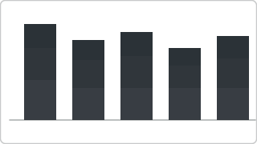

# Recipe: Stacked Bar (Absolute Values)

> **Preview:** [](../../assets/chart-previews/stacked-bar-absolute.svg)

- **id:** `stacked-bar-absolute`
- **Visual type:** `barChart` (horizontal stacked) OR `columnChart` (vertical stacked)
- **Typical size:** 536 × 384

> Complement to [`stacked-bar-100.md`](stacked-bar-100.md). Use absolute stacking
> when **total magnitude matters** (e.g., revenue volume by segment). Use
> `stacked-bar-100` when only **share / mix** matters.

---

## Composition

```
┌────────────────────────────────────────┐
│ Q1  ████████ ▓▓▓▓ ░░░  $8.4M            │
│ Q2  ██████████ ▓▓▓▓▓ ░░░░ $10.2M        │
│ Q3  █████████ ▓▓▓▓ ░░░  $9.1M           │
│ Q4  ███████████ ▓▓▓▓▓▓ ░░░░░ $12.3M     │
│ █ Segment A  ▓ Segment B  ░ Segment C   │
└────────────────────────────────────────┘
```

---

## Slots

| Slot | Purpose | Binding example |
|---|---|---|
| Axis | Category dimension (entity or time) | `DimDate[Quarter]` |
| Legend | Stack dimension (≤ 5 segments) | `DimSegment[SegmentName]` |
| Values | Primary additive measure | `[Total Revenue]` |
| Tooltip | Optional context | `[YoY %]`, `[Share %]` |

---

## Formatting (theme-aware)

- **Segment colors:** `data0…data4` in stack order; never rainbow
- **Base segment** (anchored at zero): most important segment goes at the base
  because it shares the axis baseline and is most comparable across bars
- **Data labels:** total label at bar end ON; segment labels ON only if ≤ 3
  segments and bars are wide enough
- **Legend:** bottom, horizontal, 10pt
- **Gridlines:** minor OFF, major muted

---

## Narrative frame by style

| Style | Layout tweaks |
|---|---|
| Executive | ≤ 3 segments, total label only, one segment highlighted |
| Analytical | Up to 5 segments, segment labels on largest bar only, tooltip verbose |
| Operational | Stack by status (good/warn/bad), total label as status glyph |

---

## Do-NOT list

- ❌ > 5 stack segments (non-baseline segments become unreadable — use
  small-multiples or matrix)
- ❌ Stacking non-additive measures (DISTINCTCOUNT, ratios, percentages)
- ❌ Using stacks to compare one segment across categories (eye can only
  compare the baseline segment — switch to clustered bar)
- ❌ Mixing positive and negative values in the same stack (use diverging bar
  or waterfall instead)
- ❌ 3D stacked variants ever

---

## Absolute vs 100% — decision rule

| Use | When |
|---|---|
| **Absolute stacked** (this recipe) | Total magnitude matters AND mix is secondary context |
| **100% stacked** ([`stacked-bar-100`](stacked-bar-100.md)) | Only share / composition matters |
| **Clustered bar** ([`bar-comparison`](bar-comparison.md)) | Comparing segments across categories is the primary story |

---

## Data quality gotchas

- Negative segment values destroy the stack (bars cross the axis) — filter or
  switch recipe
- Stack order is alphabetical by default — set explicit sort order in the
  visual's legend-sort property
- Grand total of the stack must equal the sum of segments; verify no
  missing-segment gaps

---

## Checklist

- [ ] ≤ 5 segments
- [ ] Measure is additive (no ratios, no distinct counts)
- [ ] No negative values in any segment
- [ ] Stack order explicit (largest or most-important segment at base)
- [ ] Total label at bar end ON
- [ ] Legend order matches stack order
- [ ] Recipe choice documented in Design Spec §5 (why absolute not 100%)
