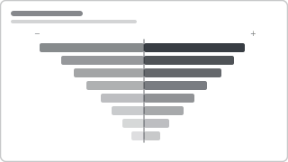

# Recipe: Tornado (Sensitivity / Diverging)

> **Preview:** [](../../assets/chart-previews/tornado-chart.svg)

- **id:** `tornado-chart`
- **Visual type:** Custom visual `TornadoChart` OR built-in `barChart` with positive/negative series
- **Typical size:** 560 × 440

---

## Composition

```
                    ◄── Group A   │   Group B ──►
  Factor 1 ██████████████████████ │ ████████
  Factor 2    ████████████████    │ ██████████████
  Factor 3          ██████        │ ████████████████████
  Factor 4             ████       │ ██
  Factor 5                ██      │ ██████████████████████
            ─────────────────────┼─────────────────────
            -50%        0        │        +50%
```

Two groups plotted mirror-image around a central axis. Used for **sensitivity analysis**
(impact of each factor on outcome) or **A vs B comparison** across many factors.

---

## Slots

| Slot | Content | Binding example |
|---|---|---|
| Group | Categorical axis | `Factor.FactorName` |
| Values (left / right) | Two measures OR one measure split by category | `[Impact Low]`, `[Impact High]` OR `[Value by Male]`, `[Value by Female]` |
| Sort | By absolute magnitude DESC | Largest impact on top |

---

## Formatting (theme-aware)

- **Left bar color:** `data0` (or `bad` for risk factor in sensitivity)
- **Right bar color:** `data1` (or `good` for opportunity factor)
- **Bar labels:** show value on each side (do NOT combine into one label)
- **Sort:** by SUM of absolute values DESC — tornado narrows top-to-bottom. This is the visual's signature.
- **Axis:** symmetrical around zero; both sides must use the same scale

---

## Narrative frame

- **Executive:** primary use case for sensitivity analysis — put the top 5 drivers on page 1 of a what-if
- **Analytical:** pair with a what-if slicer that drives the measure values live
- **Operational:** rarely used — tornado is analytical/exploratory

---

## Do NOT

- Use a tornado when **only one side has data** (use a normal bar chart)
- Use **unequal scales** on left vs right — defeats the visual comparison
- Use tornado for **> 15 factors** — too tall, tornado effect vanishes
- Use tornado for **time series** (use trend-line)
- Stack multiple series inside each half — one measure per side, period

---

## Data quality gotchas

- **Sign convention:** left side values must be stored as positive numbers even though plotted left. The visual flips them. Storing negative values doubles the flip.
- **Sensitivity inputs:** low/high columns must come from a genuine sensitivity calculation, not two random snapshots
- **Missing factors:** if a factor is absent from one group, show zero not blank — otherwise bars look asymmetrically cropped
- **Custom visual overhead:** `TornadoChart` is a public custom visual — register its ID in `report.json` → `publicCustomVisuals`. Prefer built-in `barChart` with a diverging measure when you can.

---

## Checklist

- [ ] Sorted by absolute magnitude DESC (tornado shape)
- [ ] Symmetric scale around zero
- [ ] Both-side data labels shown
- [ ] ≤ 15 factors
- [ ] Custom visual registered in `report.json` if using the marketplace one
- [ ] Values positive on both sides (storage-wise)
- [ ] Alt text: "Tornado chart of <N> factors, largest impact <factor> at <value>"
