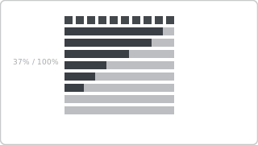

# Recipe: Waffle Chart

> **Preview:** [](../../assets/chart-previews/waffle-chart.svg)

- **id:** `waffle-chart`
- **Visual type:** `WaffleChart1453776852267` ★ (custom visual)
- **Typical size:** 320 × 320 (square, 10×10 grid)

---

## Composition

```
┌──────────────────────┐
│ ■ ■ ■ ■ ■ ■ ■ □ □ □   │   Market Share
│ ■ ■ ■ ■ ■ ■ ■ □ □ □   │   68%
│ ■ ■ ■ ■ ■ ■ ■ □ □ □   │
│ ■ ■ ■ ■ ■ ■ ■ □ □ □   │
│ ■ ■ ■ ■ ■ ■ ■ ▓ ▓ ▓   │
│ ■ ■ ■ ■ ■ ■ ■ ▓ ▓ ▓   │
│ ■ ■ ■ ■ ■ ■ ▓ ▓ ▓ ▓   │
│ ■ ■ ■ ■ ■ ▓ ▓ ▓ ▓ ░   │
│ ■ ■ ■ ■ ▓ ▓ ▓ ░ ░ ░   │
│ ■ ■ ■ ▓ ▓ ░ ░ ░ ░ ░   │
│ ■ Us  ▓ Them  □ Unallocated │
└──────────────────────┘
```

10×10 grid of 100 squares — one square per 1%. Intuitive for ratios /
percentages.

---

## Slots

| Slot | Purpose | Binding example |
|---|---|---|
| Category | Part-to-whole dimension | `DimSegment[SegmentName]` |
| Values | Share measure (%) | `[Share %]` |

---

## Formatting (theme-aware)

- **Square fill:** `data0…data4` by category
- **Square border:** 0.5px `background`
- **Unallocated squares:** `background2` with 20% opacity
- **Labels:** inline legend with % per category

---

## Narrative frame by style

| Style | Configuration |
|---|---|
| Executive | 1–3 categories, large grid, center % callout |
| Analytical | Up to 5 categories, small multiples across a dimension |
| Operational | Threshold coloring (e.g., capacity utilization) |

---

## Do-NOT list

- ❌ > 5 categories (visual fills resemble noise)
- ❌ Non-100% totals (the grid IS 100)
- ❌ Rounding errors leaving orphan squares (always normalize)
- ❌ Using when precise % delta comparison matters (→ `bar-comparison`)
- ❌ Rainbow palette

---

## When to use vs alternatives

| Use | When |
|---|---|
| **Waffle** | 1–3 segments, intuitive % explanation to non-technical audience |
| **Stacked bar 100%** | > 3 segments OR comparing across entities |
| **Pie** | NEVER (banned) |

---

## Data quality gotchas

- Measures must sum to exactly 100 — round residuals into the largest category
- Fractional shares < 1% disappear — roll up into "Other"
- Multiple waffles side-by-side require synchronized grid sizes

---

## Checklist

- [ ] ≤ 5 categories
- [ ] Total sums to exactly 100
- [ ] Unallocated squares styled distinctly if < 100%
- [ ] Grid is 10×10 (100 squares)
- [ ] Custom visual registered in `report.json`
- [ ] Palette uses theme tokens, not rainbow
