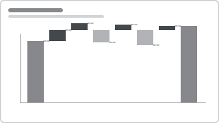

# Recipe: Waterfall Bridge

> **Preview:** [](../../assets/chart-previews/waterfall-bridge.svg)

- **id:** `waterfall-bridge`
- **Visual type:** `waterfallChart`
- **Typical size:** 1632 × 384 (hero or wide supporting)

---

## Composition

```
┌────────────────────────────────────────────────────────────────┐
│                  +$2.1M                                        │
│  $10M ──────────  ██                                           │
│                   ██   ─$1.2M                                  │
│                   ██    ██                     +$0.4M  $10.8M  │
│                   ██    ██   +$0.5M             ██     ████    │
│  $8M   ████       ██    ██    ██   ─$0.3M       ██     ████    │
│        ████       ██    ██    ██    ██          ██     ████    │
│        ████       ██    ██    ██    ██          ██     ████    │
│                                                                │
│       Opening  Revenue  COGS  Pricing  Returns  Mix    Net    │
└────────────────────────────────────────────────────────────────┘
```

---

## Slots

| Slot | Purpose | Binding example |
|---|---|---|
| Category (bridge steps) | Ordered categorical axis | `[Bridge Category]` (DAX-generated ordered list) |
| Value (delta per step) | Signed delta per step | `[Bridge Delta]` (signed) |
| Start pillar | Opening value | First category in the ordered list |
| End pillar | Closing value | Last category |

---

## Formatting (theme-aware)

- **Increase color:** `good` (theme's positive color, not arbitrary green)
- **Decrease color:** `bad`
- **Pillar (start/end) color:** `neutral` or `foreground` muted
- **Data labels:** ON for every step, formatted with sign (`+$2.1M`, `-$1.2M`)
- **Connecting lines:** ON (helps reader trace the flow)

---

## Narrative frame by style

| Style | Typical use |
|---|---|
| Executive | P&L walk (Revenue → Gross Profit → Operating Income → Net Income) with large callouts |
| Analytical | Variance bridge (Plan → Actual) broken by contributor (price, volume, mix, FX) |
| Operational | Rarely used |

---

## Bridge construction (most common pattern)

In the model, build a `BridgeSteps` table with:
- `StepName` (text)
- `StepOrder` (int, for axis sort)
- `Sign` (+1 / -1)

Then a `[Bridge Delta]` measure using SWITCH on `StepName` to compute the correct signed delta. Document this in Design Spec §5 and Phase 3 (DAX expert).

The waterfall visual then binds:
- Category axis → `BridgeSteps[StepName]` (sorted by StepOrder)
- Value → `[Bridge Delta]`

---

## Do-NOT list

- ❌ Include > 10 bridge categories (reader cannot trace)
- ❌ Mix additive and multiplicative decomposition in the same bridge
- ❌ Use default green/red — use theme's `good`/`bad` tokens
- ❌ Omit the pillars (start + end) — they anchor the story
- ❌ Use without labeled deltas (the whole point is magnitude of each step)

---

## Data quality gotchas

- **Sign direction** — confirm user's convention (do cost increases show up as positive bars reducing profit, or as negative bars reducing profit? Document and stick to one)
- **Step ordering** — must be explicit via sort column, NOT alphabetical
- **Unit consistency** — every step in same unit (you can't mix $ and %)
- **Rounding** — sum of deltas must reconcile to end-minus-start (if not, add a "Rounding" step rather than hiding discrepancy)

---

## Alternative when > 10 categories

- Use a **matrix** with running total column
- Or a **combo chart** (bars for deltas + line for running total)
- Or split into 2-3 nested waterfalls (stage 1 bridge → stage 2 bridge)

---

## Checklist

- [ ] Bridge steps come from an explicit bridge-steps table with sort order
- [ ] Start + end pillars present
- [ ] Delta labels with sign on every step
- [ ] Increase / decrease colors from theme tokens (good/bad)
- [ ] ≤ 10 steps (else decompose)
- [ ] Sum of deltas reconciles to end-minus-start
