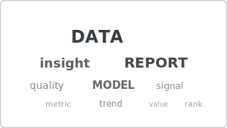

# Recipe: Word Cloud

> **Preview:** [](../../assets/chart-previews/word-cloud.svg)

- **id:** `word-cloud`
- **Visual type:** `WordCloud1447959067750` ★ (custom visual)
- **Typical size:** 560 × 320

---

## Composition

```
┌────────────────────────────────────────┐
│                                          │
│     quality   SERVICE     delivery       │
│       price    PRODUCT   support          │
│     easy    EXPERIENCE    fast            │
│       value     helpful   friendly        │
│                                          │
└────────────────────────────────────────┘
```

Words sized by frequency or weight. Good for qualitative / survey text
preview; poor for precise comparison.

---

## Slots

| Slot | Purpose | Binding example |
|---|---|---|
| Category | Word / term | `FactSurvey[Term]` |
| Values | Frequency / weight | `[TermCount]` |
| Exclude list | Stopwords | Model-level filter |

---

## Formatting (theme-aware)

- **Text color:** `foreground` (monochrome preferred) OR `data0…data4` for sentiment tagging
- **Background:** transparent
- **Min / max font:** 12pt / 48pt
- **Rotation:** 0° / 90° only (avoid all-angle rotation)

---

## Narrative frame by style

| Style | Configuration |
|---|---|
| Executive | As teaser for a detail page (qualitative signal only) |
| Analytical | Paired with a bar-comparison of the same terms for precision |
| Operational | Not recommended — exact counts matter more |

---

## Do-NOT list

- ❌ Using as the only chart (qualitative; needs quantitative companion)
- ❌ Relying on word size for precise value comparison
- ❌ Skipping stopword filtering ("the", "and" dominate)
- ❌ All-angle rotation (illegible)
- ❌ Rainbow per-word coloring without semantic meaning

---

## Data quality gotchas

- Stemming / lemmatization needed at ETL ("run", "running", "ran" → "run")
- Language-specific stopwords required for non-English text
- Single-character and numeric terms typically should be filtered
- Case sensitivity — normalize to lowercase before aggregating

---

## Checklist

- [ ] Stopwords filtered
- [ ] Case normalized
- [ ] Rotation ≤ 2 angles
- [ ] Monochrome OR semantic coloring only
- [ ] Paired with a quantitative chart for precision
- [ ] Custom visual registered in `report.json`
