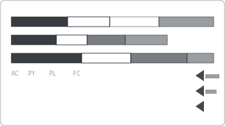

# Recipe: Zebra BI Variance

> **Preview:** [](../../assets/chart-previews/zebra-bi-variance.svg)

- **id:** `zebra-bi-variance`
- **Visual type:** `variance8E4BB1B41A8942A7B897C7014A6E1F56` ★ OR `zebraBiCards2C860CFAA9944091B75F0DBD117F20FA` ★
- **Typical size:** 824 × 320

---

## Composition

```
┌────────────────────────────────────────────────┐
│ Revenue     AC ████████  $4.2M                    │
│             PY ██████    $3.7M   ▲+13.5%           │
│             FC ████████▓ $4.5M   ▼-6.7% vs FC      │
│                                                     │
│ Margin %    AC ████      38.4%                      │
│             PY ███▒      35.1%   ▲+3.3 pp           │
└────────────────────────────────────────────────┘
```

IBCS-compliant (International Business Communication Standards) actual /
prior / forecast variance visual. Standardized notation audiences trained
on IBCS recognize instantly.

---

## Slots

| Slot | Purpose | Binding example |
|---|---|---|
| AC (Actual) | Current measure | `[Revenue]` |
| PY (Prior Year) | Prior period | `[Revenue PY]` |
| BU / PL (Budget / Plan) | Plan measure | `[Revenue Plan]` |
| FC (Forecast) | Forecast measure | `[Revenue Forecast]` |
| Category | Entity rows | `DimProduct[ProductName]` |

---

## Formatting (theme-aware)

- **AC:** solid `foreground` (dark)
- **PY:** hollow outline (gray)
- **PL:** cross-hatched
- **FC:** striped
- **Variance arrows:** `good` (+) / `bad` (-) with explicit pp / % labels
- **No rainbow** — IBCS is intentionally monochrome + pattern-based

---

## Narrative frame by style

| Style | Configuration |
|---|---|
| Executive | IBCS-familiar audience only; otherwise use `yoy-variance` |
| Analytical | Full AC / PY / PL / FC decomposition, verbose variance |
| Operational | Variance arrows prominent, absolute values de-emphasized |

---

## Do-NOT list

- ❌ Using with non-IBCS-trained audiences without legend / teaching
- ❌ Replacing IBCS notation with custom colors (defeats the standard)
- ❌ Mixing IBCS variance with non-IBCS charts on the same page (inconsistency)
- ❌ Showing raw deltas without % labels
- ❌ Rainbow palettes ever

---

## When to use vs `yoy-variance` / `bullet-chart`

| Use | When |
|---|---|
| **Zebra BI variance** | IBCS-standard audience; finance/controllership; dense variance reviews |
| **YoY variance** | General audience; single comparison period |
| **Bullet chart** | Actual vs one target with threshold bands |

---

## Data quality gotchas

- AC / PY / PL / FC measures must use consistent filter context (date, entity)
- Variance is AC − PY (or AC − PL), not PY − AC — verify DAX direction
- % change for negative baseline needs special handling (e.g., "from loss to profit")

---

## Checklist

- [ ] Audience is IBCS-trained (or legend is provided)
- [ ] AC / PY / PL / FC measures all defined
- [ ] Variance arrow direction matches sign convention (high is good vs bad)
- [ ] Monochrome + pattern (no rainbow)
- [ ] Custom visual registered in `report.json`
