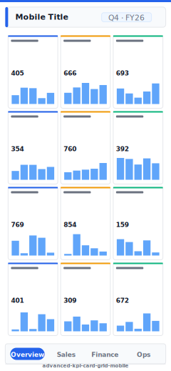

# Advanced KPI Card Grid (Mobile)

> **Preview:**  · variants: [annotated](../../assets/layout-previews/advanced-kpi-card-grid-mobile-annotated.svg) · [dark](../../assets/layout-previews/advanced-kpi-card-grid-mobile-dark.svg)

> **Derived layout** — Mobile portrait variant of [`advanced-kpi-card-grid`](./advanced-kpi-card-grid.md).

- Canvas: `390×844` (mobile-portrait)
- Visuals: 8
- Zones: `mobile-title, mobile-nav-tabs`
- Use when: Mobile / phone variant of `advanced-kpi-card-grid`. Same insight, stacked single-column layout.
- Avoid when: Desktop screens — prefer the parent landscape layout.

See the base recipe [`advanced-kpi-card-grid.md`](./advanced-kpi-card-grid.md) for the full narrative. This variant inherits intent and data requirements; it differs only in canvas, zone stacking, and visual density. Recommended themes, interaction model, and data requirements are documented in `layouts-index.json` under `id: advanced-kpi-card-grid-mobile`.
