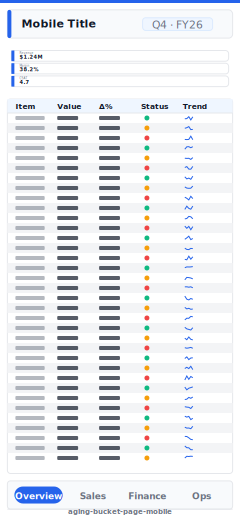

# Aging Bucket Page (Mobile)

> **Preview:**  · variants: [annotated](../../assets/layout-previews/aging-bucket-page-mobile-annotated.svg) · [dark](../../assets/layout-previews/aging-bucket-page-mobile-dark.svg)

> **Derived layout** — Mobile portrait variant of [`aging-bucket-page`](./aging-bucket-page.md).

- Canvas: `390×844` (mobile-portrait)
- Visuals: 6
- Zones: `mobile-title, mobile-kpi-stack, mobile-nav-tabs`
- Use when: Mobile / phone variant of `aging-bucket-page`. Same insight, stacked single-column layout.
- Avoid when: Desktop screens — prefer the parent landscape layout.

See the base recipe [`aging-bucket-page.md`](./aging-bucket-page.md) for the full narrative. This variant inherits intent and data requirements; it differs only in canvas, zone stacking, and visual density. Recommended themes, interaction model, and data requirements are documented in `layouts-index.json` under `id: aging-bucket-page-mobile`.
