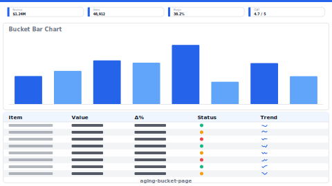

# Layout: Aging Bucket Page

> **Preview:** [](../../assets/layout-previews/aging-bucket-page.svg) · variants: [annotated](../../assets/layout-previews/aging-bucket-page-annotated.svg) · [dark](../../assets/layout-previews/aging-bucket-page-dark.svg)

- **id:** `aging-bucket-page`
- **Canvas:** 1664 × 936
- **Style personality:** Analytical — Stacked bars segmented by aging buckets (0–30 / 31–60 / 61–90 / 90+) + overdue KPI + detail table
- **Audience:** AR / credit controllers, inventory managers — anyone reviewing 'how old is this exposure'
- **Visual count:** 10 — reflow-enhanced (was 8)
- **Pairs with themes:** neutral body with one accent — pattern designed to read on any corporate palette.
- **Observed in:** `references-pbip/Sales Analysis - IMP Demo.Report/` — 'AGING STOCK' and 'ACCOUNT RECEIVABLE' (29 visuals)

---

## Zone map

```
┌────────────────────────────────────────────────────────────────┐ 0
│ Header + period + entity slicer                                │ 78
├────────────────────────────────────────────────────────────────┤
│ KPI card row · Total outstanding · Overdue% · Avg days · Risk  │ 130
├────────────────────────────────────┬───────────────────────────┤
│                                    │                           │
│ BUCKET BARS (stacked by age)       │  Bucket donut (% of total)│ 416
│  rows = entity, bars = amount       │                          │
│  segmented by 0-30/31-60/61-90/90+  │                          │
│                                    │                           │
├────────────────────────────────────┴───────────────────────────┤
│ Detail table: entity · total · per-bucket · days overdue       │ 312
└────────────────────────────────────────────────────────────────┘
```

---

## Slot specifications

| Slot | x | y | w | h | Visual type | Notes |
|---|---|---|---|---|---|---|
| Header | 0 | 0 | 1664 | 78 | shape + textbox + slicer(Period) + slicer(Entity) | Title and filters |
| KPI card 1 · Total outstanding | 21 | 88 | 393 | 120 | card | Amount + YoY delta |
| KPI card 2 · Overdue % | 424 | 88 | 393 | 120 | card | % of outstanding aged > 30d |
| KPI card 3 · Avg days overdue | 827 | 88 | 393 | 120 | card | Weighted avg days |
| KPI card 4 · Risk score | 1230 | 88 | 413 | 120 | card | Composite indicator |
| Bucket bars | 21 | 218 | 1170 | 416 | stackedBarChart (category = entity; series = bucket) | Top-N entities by total outstanding |
| Bucket donut | 1201 | 218 | 442 | 416 | donutChart (category = bucket) | % mix by age bucket |
| Detail table | 21 | 645 | 1622 | 281 | tableEx | Entity · Total · <30 · 31-60 · 61-90 · 90+ · Days |

Gutters: 16px between primary zones; 8px inside KPI card rows.

---

## Navigation

- Reachable from the report's top-nav chiclet strip or landing page. Include a small 'Home' actionButton in the header when not the landing page.
- Cross-links out to related drillthrough / detail pages should be surfaced via card-level actions, not a separate nav rail.

---

## Theme + iconography guidance

- **Palette:** Four-bucket sequential ramp (light→dark) with the 90+ bucket in a warning accent. Rest neutral.
- **Logo:** Header top-left at (16, 16) max height 24px.
- **Icons:** Clock glyph next to each aging-related card title.
- **Fonts:** KPI value 22pt, bar labels 9pt, table 10pt.

---

## When NOT to use this layout

- ❌ Question is about *current* balance only, not aging — use `scorecard-kpi-grid`
- ❌ < 3 aging buckets — stacked bars give no advantage
- ❌ Data is anonymized / no entity dimension — collapse to a single donut

---

## Customization allowed

- Replace donut with a trend of overdue% over time if trend is important
- Add a forecast card (expected collection / writeoff)

## Customization NOT allowed

- Changing bucket boundaries between pages of the same report (breaks comparison)
- Colouring all buckets the same (defeats the whole purpose)

---

## Reflow additions (v0.6)

The donut summarises the age mix but collectors need **risk watchlist** (entities with >90d exposure accelerating) and **expected-collection forecast** (next-30-day cash in). Both are the natural 'so what' follow-ups to the aging view.

### Integration

Shrink **Bucket donut** from `w=442` to `w=310` (still legible; labels may move to a legend below). Watchlist mini-list fits at `x=1523, y=218, w=120, h=416`. Expected-collection forecast card replaces the right-most KPI slot — shrink KPI 4 from `w=413` to `w=280`, add forecast card at `x=1523, y=88, w=120, h=120`.

### New slots

| Slot | x | y | w | h | Visual type | Notes |
|---|---|---|---|---|---|---|
| Risk watchlist mini-list | 1523 | 218 | 120 | 416 | tableEx (compact) | Top 6 entities with 90+ bucket accelerating; single-column rank |
| Expected-collection card | 1523 | 88 | 120 | 120 | card | Next-30d forecasted collection amount + confidence % |

