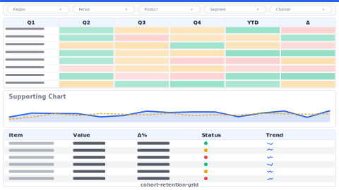

# Layout: Cohort / Retention Grid

> **Preview:** [](../../assets/layout-previews/cohort-retention-grid.svg) · variants: [annotated](../../assets/layout-previews/cohort-retention-grid-annotated.svg) · [dark](../../assets/layout-previews/cohort-retention-grid-dark.svg)

- **id:** `cohort-retention-grid`
- **Canvas:** 1664 × 936
- **Style personality:** Analytical — Period-indexed cohort matrix (cohort vs. age-in-months) + supporting ranking / trend
- **Audience:** Customer analytics leads, growth / retention analysts
- **Visual count:** 9 — reflow-enhanced (was 7)
- **Pairs with themes:** neutral body with one accent — pattern designed to read on any corporate palette.
- **Observed in:** `references-pbip/Retail Sales Analysis Demo.Report/` — 'Cohort Analysis' (13 visuals)

---

## Zone map

```
┌────────────────────────────────────────────────────────────────┐ 0
│ Header: title · cohort-month slicer · metric toggle            │ 78
├────────────────┬───────────────────────────────────────────────┤
│                │                                               │
│ Slicer rail    │   COHORT MATRIX (rows = cohort, cols = M+n)   │ 572
│  · Cohort      │                                               │
│  · Segment     │                                               │
│  · Metric      │                                               │
│                │                                               │
├────────────────┼───────────────────────┬───────────────────────┤
│                │  Retention curve      │  Cohort size bars     │ 260
│                │  (line, indexed)      │  (by cohort month)    │
│                │                       │                       │
└────────────────┴───────────────────────┴───────────────────────┘
```

---

## Slot specifications

| Slot | x | y | w | h | Visual type | Notes |
|---|---|---|---|---|---|---|
| Header | 0 | 0 | 1664 | 78 | shape + textbox + slicer | Title + cohort-month + metric toggle |
| Slicer rail | 0 | 78 | 312 | 858 | slicer × 3 | Cohort / Segment / Metric |
| Cohort matrix | 322 | 88 | 1331 | 572 | matrix (with conditional formatting gradient) | Rows = cohort month, columns = age bucket (M+0..M+11) |
| Retention curve | 322 | 671 | 650 | 260 | lineChart | Indexed retention% by age bucket, series = segment |
| Cohort size bars | 983 | 671 | 671 | 260 | clusteredColumnChart | # customers per cohort month |

Gutters: 16px between primary zones; 8px inside KPI card rows.

---

## Navigation

- Reachable from the report's top-nav chiclet strip or landing page. Include a small 'Home' actionButton in the header when not the landing page.
- Cross-links out to related drillthrough / detail pages should be surfaced via card-level actions, not a separate nav rail.

---

## Theme + iconography guidance

- **Palette:** Sequential single-hue for cohort matrix (data-ink); neutral rest. Retention curve uses one accent.
- **Logo:** Header top-left at (16, 16) max height 24px.
- **Icons:** Optional clock / funnel glyph next to 'Cohort'.
- **Fonts:** Header 16pt, matrix cells 10pt, axis 9pt.

---

## When NOT to use this layout

- ❌ Data does not have a clear acquisition event / cohort key — the matrix collapses
- ❌ Audience is executive (too granular) — summarize with `scorecard-kpi-grid` + a single retention KPI instead
- ❌ Fewer than 6 cohort periods — a bar chart is enough

---

## Customization allowed

- Change matrix conditional formatting from absolute counts to row-% (index)
- Replace cohort-size bars with a lifetime-value line chart

## Customization NOT allowed

- Removing the matrix — defeats the pattern
- Exceeding 18 cohort columns (matrix becomes illegible)

---

## Reflow additions (v0.6)

Cohort matrix is the star but without a **benchmark line** on the retention curve you can't tell whether retention is 'good'. A **cohort-quality KPI** in the header (Avg M+3 retention, trend arrow) anchors the page's headline number.

### Integration

Retention curve shrinks from `w=650` to `w=510`; benchmark callout panel occupies `x=842, y=671, w=130, h=260`. Cohort-quality KPI fits in the header right side at `x=1280, y=16, w=363, h=52`.

### New slots

| Slot | x | y | w | h | Visual type | Notes |
|---|---|---|---|---|---|---|
| Cohort-quality KPI | 1280 | 16 | 363 | 52 | card | Avg M+3 retention % + trend arrow (vs prior cohort); 18pt value |
| Benchmark callout | 842 | 671 | 130 | 260 | card + shape | Industry benchmark band shown as horizontal reference line on curve, with value card |

