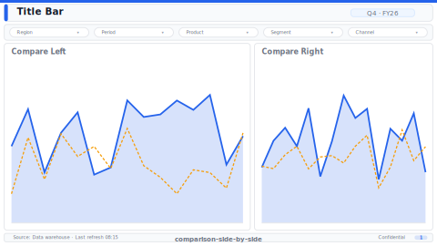

# Side-by-Side Comparison

> **Preview:**  · variants: [annotated](../../assets/layout-previews/comparison-side-by-side-annotated.svg) · [dark](../../assets/layout-previews/comparison-side-by-side-dark.svg)

- Canvas: `1664×936` (landscape-16x9)
- Style: `analytical` · Domain: `cross-domain`
- Visuals: 6
- Zones: `title-bar, shared-slicer, compare-left, compare-right, footer`

## Use when
A/B comparison canvas — two symmetric halves with a shared slicer

## Avoid when
More than 2 entities to compare — use scorecard-kpi-grid

## Recommended themes
`microsoft-fluent`, `consulting-authority`, `corporate-financial`

## Chart patterns
`kpi-card-with-spark`, `line-yoy`, `ranking-bar`

## Data requirements
- min_rows: 20
- required_measures: `metric`
- required_dimensions: `entity`
- date_grain: `any`

See `layouts-index.json` for full machine-readable entry including `zones_detail[]`.
