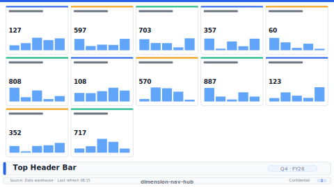

# Layout: Dimension Nav Hub

> **Preview:** [](../../assets/layout-previews/dimension-nav-hub.svg) · variants: [annotated](../../assets/layout-previews/dimension-nav-hub-annotated.svg) · [dark](../../assets/layout-previews/dimension-nav-hub-dark.svg)

- **id:** `dimension-nav-hub`
- **Canvas:** 1664 × 936
- **Style personality:** Executive — Full-page button grid jumping to every dimension / sub-report
- **Audience:** All report consumers — entry point to multi-page reports
- **Visual count:** 7
- **Pairs with themes:** neutral body with one accent — pattern designed to read on any corporate palette.
- **Observed in:** `references-pbip/Daikin_DAV Daily Report.Report/` — 'Navigation'; `Daikin_MDC Daily Report.Report/` — 'Navigation'

---

## Zone map

```
┌────────────────────────────────────────────────────────────────┐ 0
│ Logo · Report title · Period selector · Back/Home              │ 104
├────────────────────────────────────────────────────────────────┤
│                                                                │
│   ┌──────┐  ┌──────┐  ┌──────┐                                 │
│   │ SBU  │  │ Dept │  │ Date │   (three big nav tiles row 1)   │
│   └──────┘  └──────┘  └──────┘                                 │
│                                                                │
│   ┌──────┐  ┌──────┐  ┌──────┐                                 │
│   │Series│  │  KW  │  │Svc.St│   (three big nav tiles row 2)   │
│   └──────┘  └──────┘  └──────┘                                 │
├────────────────────────────────────────────────────────────────┤
│ Footer: "Last refresh · Data source · Contact owner"           │ 52
└────────────────────────────────────────────────────────────────┘
```

---

## Slot specifications

| Slot | x | y | w | h | Visual type | Notes |
|---|---|---|---|---|---|---|
| Header band | 0 | 0 | 1664 | 104 | shape + image + textbox | Logo left, title centre, period slicer right |
| Tile row 1 · 3 tiles | 104 | 156 | 1456 | 312 | actionButton(s) with background image | Each tile ~360w x 240h, 20px gutter |
| Tile row 2 · 3 tiles | 104 | 494 | 1456 | 312 | actionButton(s) with background image | Mirror row 1 |
| Footer | 0 | 884 | 1664 | 52 | textbox | Metadata strip |

Gutters: 16px between primary zones; 8px inside KPI card rows.

---

## Navigation

- Reachable from the report's top-nav chiclet strip or landing page. Include a small 'Home' actionButton in the header when not the landing page.
- Cross-links out to related drillthrough / detail pages should be surfaced via card-level actions, not a separate nav rail.

---

## Theme + iconography guidance

- **Palette:** Brand hero colour as tile fill; neutral page background.
- **Logo:** Top-left header at (24, 24) max height 32px. Locked.
- **Icons:** One large icon per tile (48-64px) — dimension glyph (user, calendar, factory, pin).
- **Fonts:** Title 22pt Semibold, tile label 16pt Semibold, metadata 10pt Regular.

---

## When NOT to use this layout

- ❌ Report has ≤ 4 pages (a top-nav chiclet strip is enough — see `chiclet-nav-strip`)
- ❌ Users enter the report with a specific question, not to browse — use `exec-overview-16x9` as landing
- ❌ Mobile consumption — tile grid does not resize well; use `mobile-portrait-9x16`

---

## Customization allowed

- Add a small 'Getting started' textbox in one empty corner (max 3 lines)
- Replace the 2x3 grid with a 3x2 grid if dimension names are long

## Customization NOT allowed

- Adding data visuals (turns into a dashboard — use `exec-overview-16x9` instead)
- Animating tiles on load (confuses the purpose)
