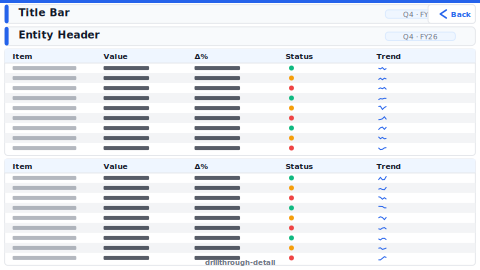

# Layout: Drillthrough Detail

> **Preview:** [](../../assets/layout-previews/drillthrough-detail.svg) · variants: [annotated](../../assets/layout-previews/drillthrough-detail-annotated.svg) · [dark](../../assets/layout-previews/drillthrough-detail-dark.svg)

- **id:** `drillthrough-detail`
- **Canvas:** 1664 × 936
- **Style personality:** Analytical
- **Audience:** Analyst investigating a specific entity (product, customer, region, store)
- **Visual count:** 6 (excluding back button)
- **Entry:** right-click drillthrough from any hub page

---

## Zone map

```
┌────────────────────────────────────────────────────────────────┐ 0
│ [Back]   Entity: {selected name}                               │ 56
├────────────────────────────────────────────────────────────────┤
│   Entity header: key attributes (textbox / card grid)          │ 128
├────────────────────────────────────────────────────────────────┤
│  ┌────────────┐  ┌────────────┐                                │
│  │ Metric 1   │  │ Metric 2   │                                │ 384
│  │ trend      │  │ breakdown  │                                │
│  └────────────┘  └────────────┘                                │
├────────────────────────────────────────────────────────────────┤
│  ┌────────────┐  ┌────────────┐                                │
│  │ Metric 3   │  │ Metric 4   │                                │ 640
│  │ comparison │  │ composition│                                │
│  └────────────┘  └────────────┘                                │
├────────────────────────────────────────────────────────────────┤
│   Transactions table (top 20, sortable)                        │ 936
└────────────────────────────────────────────────────────────────┘
```

---

## Slot specifications

| Slot | x | y | w | h | Visual type | Notes |
|---|---|---|---|---|---|---|
| Back button | 16 | 16 | 96 | 32 | button | **REQUIRED** — wired to source page or prev. Icon: chevron-left |
| Entity title | 128 | 16 | 1520 | 32 | textbox | Binds to the drillthrough field |
| Entity header | 16 | 56 | 1632 | 72 | multi-row card OR textbox grid | 3-5 attributes: ID, owner, start-date, etc. |
| Metric 1: trend | 16 | 136 | 816 | 248 | line | |
| Metric 2: breakdown | 840 | 136 | 808 | 248 | bar | |
| Metric 3: comparison | 16 | 392 | 816 | 248 | column / bar | YoY, vs peers, vs plan |
| Metric 4: composition | 840 | 392 | 808 | 248 | stacked bar / donut | |
| Transactions table | 16 | 648 | 1632 | 280 | table | Top 20 rows, sorted by date desc |

Gutters: 8px.

---

## Required elements (design rule)

- **Back button** — non-negotiable. Drillthrough pages without one **fail linter** (error in `design_quality_check.py`).
- **Entity title bound to the drillthrough field** — so the page shows which entity is being viewed
- **Drillthrough filter panel** — hidden (set `drillthroughFilters.hidden: true` for clean display)
- **Page visibility** — set page `hidden: true` so it doesn't appear in page tabs

---

## Theme + iconography guidance

- Same theme as the rest of the report (drillthrough is not a mode change)
- **Logo:** omit on drillthrough (this is a detail page reached from a parent; showing the logo again wastes space). If a brand mark is required by style guide, place it top-right at ≤ 16px.
- Back button icon: chevron-left or arrow-left
- No KPI-set icons on metric visuals (detail view, not status view)

---

## When NOT to use this layout

- ❌ As a primary page (it's always an entry via drillthrough)
- ❌ Executive reports (drillthrough is an analytical interaction)
- ❌ When drillthrough target has < 3 metrics to show (use tooltip page instead)

---

## Customization allowed

- Swap the 2×2 metric grid to 3×1 or 1×3 when one metric dominates
- Replace transactions table with matrix if hierarchical
- Add a second row of metrics (4→6) by compressing header

## Customization NOT allowed

- Removing the back button
- Making the page visible in tabs (defeats drillthrough UX)
- Hiding the entity title (user loses context)
