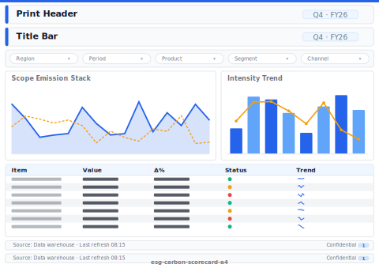

# ESG Carbon Scorecard (A4 Print)

> **Preview:**  · variants: [annotated](../../assets/layout-previews/esg-carbon-scorecard-a4-annotated.svg) · [dark](../../assets/layout-previews/esg-carbon-scorecard-a4-dark.svg)

> **Derived layout** — Print / A4 variant of [`esg-carbon-scorecard`](./esg-carbon-scorecard.md).

- Canvas: `1169×826` (print-a4-landscape)
- Visuals: 6
- Zones: `print-header, title-bar, slicer-row, scope-emission-stack, intensity-trend, target-trajectory, print-signature-block, print-footer-page-number`
- Use when: Board-pack / PDF export variant of `esg-carbon-scorecard`. Paper-safe; pairs with print_safe themes.
- Avoid when: Interactive digital viewing — print layouts drop drill/filter affordances.

See the base recipe [`esg-carbon-scorecard.md`](./esg-carbon-scorecard.md) for full narrative.
