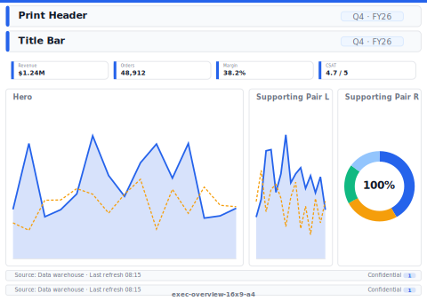

# Executive Overview (16:9) (A4 Print)

> **Preview:**  · variants: [annotated](../../assets/layout-previews/exec-overview-16x9-a4-annotated.svg) · [dark](../../assets/layout-previews/exec-overview-16x9-a4-dark.svg)

> **Derived layout** — Print / A4 variant of [`exec-overview-16x9`](./exec-overview-16x9.md).

- Canvas: `1169×826` (print-a4-landscape)
- Visuals: 4
- Zones: `print-header, title-bar, kpi-row, hero, supporting-pair, print-signature-block, print-footer-page-number`
- Use when: Board-pack / PDF export variant of `exec-overview-16x9`. Paper-safe; pairs with print_safe themes.
- Avoid when: Interactive digital viewing — print layouts drop drill/filter affordances.

See the base recipe [`exec-overview-16x9.md`](./exec-overview-16x9.md) for the full narrative. This variant inherits intent and data requirements; it differs only in canvas, zone stacking, and visual density. Recommended themes, interaction model, and data requirements are documented in `layouts-index.json` under `id: exec-overview-16x9-a4`.
