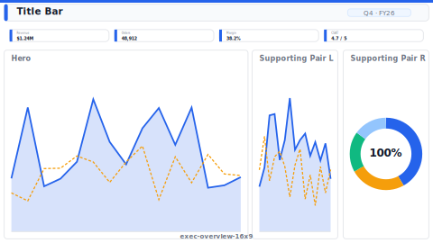

# Layout: Executive Overview (16:9)

> **Preview:** [](../../assets/layout-previews/exec-overview-16x9.svg) · variants: [annotated](../../assets/layout-previews/exec-overview-16x9-annotated.svg) · [dark](../../assets/layout-previews/exec-overview-16x9-dark.svg)

- **id:** `exec-overview-16x9`
- **Canvas:** 1664 × 936
- **Style personality:** Executive (see `../executor-executive.md`)
- **Audience:** C-suite, board, monthly/quarterly business review
- **Visual count:** 4 (excluding slicers; usually zero slicers)
- **Pairs with themes:** any restrained / muted theme; neutral background preferred

---

## Zone map

```
┌────────────────────────────────────────────────────────────────┐ 0
│                                                                │
│   Big-Idea page title (24pt Semibold)                         │ 56
│   Subtitle (14pt Regular, muted)                              │
├────────────────────────────────────────────────────────────────┤ 80
│                                                                │
│  ┌────────┐ ┌────────┐ ┌────────┐ ┌────────┐                  │
│  │ KPI 1  │ │ KPI 2  │ │ KPI 3  │ │ KPI 4  │                  │ 120
│  └────────┘ └────────┘ └────────┘ └────────┘                  │
├────────────────────────────────────────────────────────────────┤ 216
│                                                                │
│                                                                │
│        HERO visual (trend or primary breakdown)               │
│                                                                │ 400
│        Reference line(s) / target / prior-year                │
│                                                                │
├────────────────────────────────────────────────────────────────┤ 624
│                                                                │
│  ┌─────────────────────┐  ┌─────────────────────┐            │
│  │ Supporting visual 1 │  │ Supporting visual 2 │            │ 280
│  │                     │  │                     │            │
│  └─────────────────────┘  └─────────────────────┘            │
└────────────────────────────────────────────────────────────────┘ 936
```

---

## Slot specifications

| Slot | x | y | w | h | Visual type | Notes |
|---|---|---|---|---|---|---|
| Page title | 32 | 16 | 1600 | 56 | textbox | Big-Idea phrasing, 24pt Semibold |
| KPI 1 | 32 | 80 | 384 | 120 | card | Apply `chart-templates/kpi-banner.md` |
| KPI 2 | 432 | 80 | 384 | 120 | card | |
| KPI 3 | 832 | 80 | 384 | 120 | card | |
| KPI 4 | 1232 | 80 | 400 | 120 | card | |
| Hero visual | 32 | 216 | 1600 | 400 | line OR bar | `chart-templates/trend-line.md` or `bar-comparison.md` |
| Supporting 1 | 32 | 632 | 792 | 280 | varies | |
| Supporting 2 | 840 | 632 | 792 | 280 | varies | |

Gutters: 16px between KPIs, 16px between supporting, 16px vertical between zones. All multiples of 8.

---

## Navigation

Single-page — no navigation bar. If multi-page, add 48h button bar at y=72 and push KPI row down to y=128.

---

## Theme + iconography guidance

- **Palette:** muted; 1-2 accents reserved for highlight on hero visual
- **Logo:** company wordmark top-left of title bar at `(32, 24)`, max height 28px; leave the page title right of it at `(80, 24)`. Leave empty if the theme enforces text-only headers.
- **Icons:** KPI-set icons (trend-up, trend-down, target-hit) on each card
- **Fonts:** Segoe UI throughout

---

## When NOT to use this layout

- ❌ Audience is analysts or ops — too sparse
- ❌ > 4 KPIs (use Analytical's KPI banner instead)
- ❌ Dense time-series exploration needed (use Analytical hero + supporting grid)
- ❌ Multiple dimensions of comparison (use supporting grid of 3, not 2)

---

## Customization allowed

- Swap KPI count 3-5 (adjust widths proportionally, keep 16px gutter)
- Replace supporting-pair with single full-width visual if hero is itself small-multiple
- Add bottom footnote row (y=904, h=24) for methodology text

## Customization NOT allowed

- Changing canvas size (defeats the "16:9" preset)
- Adding a third supporting row (breaks the ≤ 4 visual rule for Executive)
- Removing the KPI row (KPIs are core to the Executive pattern)
