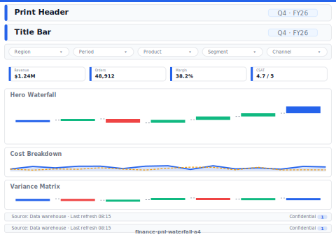

# Finance P&L Waterfall (A4 Print)

> **Preview:**  · variants: [annotated](../../assets/layout-previews/finance-pnl-waterfall-a4-annotated.svg) · [dark](../../assets/layout-previews/finance-pnl-waterfall-a4-dark.svg)

> **Derived layout** — Print / A4 variant of [`finance-pnl-waterfall`](./finance-pnl-waterfall.md).

- Canvas: `1169×826` (print-a4-landscape)
- Visuals: 6
- Zones: `print-header, title-bar, period-slicer, kpi-row-4, hero-waterfall, cost-breakdown, variance-matrix, print-signature-block, print-footer-page-number`
- Use when: Board-pack / PDF export variant of `finance-pnl-waterfall`. Paper-safe; pairs with print_safe themes.
- Avoid when: Interactive digital viewing — print layouts drop drill/filter affordances.

See the base recipe [`finance-pnl-waterfall.md`](./finance-pnl-waterfall.md) for the full narrative. This variant inherits intent and data requirements; it differs only in canvas, zone stacking, and visual density. Recommended themes, interaction model, and data requirements are documented in `layouts-index.json` under `id: finance-pnl-waterfall-a4`.
