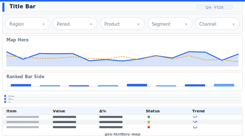

# Layout: Geographic / Territory Map

> **Preview:** [](../../assets/layout-previews/geo-territory-map.svg) · variants: [annotated](../../assets/layout-previews/geo-territory-map-annotated.svg) · [dark](../../assets/layout-previews/geo-territory-map-dark.svg)

- **id:** `geo-territory-map`
- **Canvas:** 1664 × 936
- **Style personality:** Analytical
- **Audience:** Regional managers, sales ops, logistics planners
- **Visual count:** 6
- **Pairs with themes:** any; map fill uses sequential single-hue scale

## Zone map

```
┌────────────────────────────────────────────────────────────────┐ 0
│ Title bar: "Territory performance — {Region}"                 │ 56
├────────────────────────────────────────────────────────────────┤
│ Region slicer row (Region · Sub-region · Period · Metric)     │ 40
├────────────────────────────────────────────────────────────────┤
│                                      │                         │
│        MAP HERO                      │   KPI stack (3)         │ 280
│   (filled map + bubble overlay       │   • Revenue             │
│    sized by volume)                  │   • Growth YoY          │
│                                      │   • # territories hit   │
│                                      ├─────────────────────────┤
│                                      │   Ranked bar (top 10    │ 280
│                                      │   regions, sorted)      │
├────────────────────────────────────────────────────────────────┤
│ Territory table: region × rep × revenue × plan% × status      │ 220
└────────────────────────────────────────────────────────────────┘ 936
```

## Slot specifications

| Slot | x | y | w | h | Visual type | Notes |
|---|---|---|---|---|---|---|
| Title bar | 32 | 16 | 1600 | 56 | textbox | |
| Region slicer | 32 | 80 | 1600 | 40 | slicer × 4 | |
| Map hero | 32 | 136 | 1040 | 560 | filled map / Azure Map | Bubble size = volume; fill = metric |
| KPI: Revenue | 1088 | 136 | 544 | 88 | card | |
| KPI: Growth YoY | 1088 | 232 | 544 | 88 | card | |
| KPI: Coverage | 1088 | 328 | 544 | 88 | card | |
| Ranked bar | 1088 | 424 | 544 | 272 | bar (descending) | Top 10 regions |
| Territory table | 32 | 712 | 1600 | 200 | matrix | Status column with traffic-light icons |

## Navigation

Cross-filter from map → ranked bar → table is automatic. For drill into a single rep, enable **Drillthrough** to `drillthrough-detail` page keyed on `TerritoryId`.

## Theme + iconography guidance

- **Map**: filled map first choice (no API key); Azure Map only if plot density demands it
- **Logo:** company wordmark top-left of title bar at `(32, 24)`, max height 28px. Region / country flag icons, if used, live on table rows — never on the logo slot.
- **Icons**: map-pin, compass, flag on KPIs
- **Avoid** rainbow scales — use sequential single-hue for revenue fill

## When NOT to use this layout

- ❌ No geographic grain in data
- ❌ Single territory drill (use `drillthrough-detail`)
- ❌ Logistics route detail (use dedicated route-optimization tool, not PBI)
