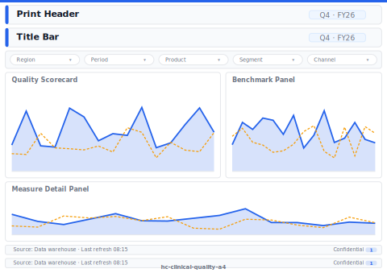

# Clinical Quality Scorecard (A4 Print)

> **Preview:**  · variants: [annotated](../../assets/layout-previews/hc-clinical-quality-a4-annotated.svg) · [dark](../../assets/layout-previews/hc-clinical-quality-a4-dark.svg)

> **Derived layout** — Print / A4 variant of [`hc-clinical-quality`](./hc-clinical-quality.md).

- Canvas: `1169×826` (print-a4-landscape)
- Visuals: 6
- Zones: `print-header, title-bar, filter-bar, quality-scorecard, benchmark-panel, measure-detail-panel, print-signature-block, print-footer-page-number`
- Use when: Board-pack / PDF export variant of `hc-clinical-quality`. Paper-safe; pairs with print_safe themes.
- Avoid when: Interactive digital viewing — print layouts drop drill/filter affordances.

See the base recipe [`hc-clinical-quality.md`](./hc-clinical-quality.md) for full narrative.
