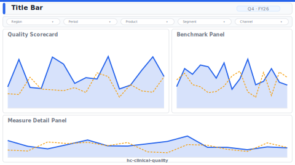

# Clinical Quality Scorecard

> **Preview:**  · variants: [annotated](../../assets/layout-previews/hc-clinical-quality-annotated.svg) · [dark](../../assets/layout-previews/hc-clinical-quality-dark.svg)

- Canvas: `1664×936` (landscape-16x9)
- Style: `executive` · Domain: `healthcare`
- Visuals: 6
- Zones: `title-bar, filter-bar, quality-scorecard, benchmark-panel, measure-detail-panel`

## Use when
Quarterly clinical quality review vs HEDIS-style benchmarks

## Avoid when
Without validated measure definitions or benchmark data

## Recommended themes
`healthcare-pharma`, `consulting-authority`, `accessible-okabe-ito`

## Chart patterns
`scorecard-matrix`, `benchmark-band`, `entity-panel`

## Data requirements
- min_rows: 20
- required_measures: `measure_score`, `benchmark`
- required_dimensions: `measure_id`, `unit`
- date_grain: `quarter`

See `layouts-index.json` for full machine-readable entry including `zones_detail[]`.
