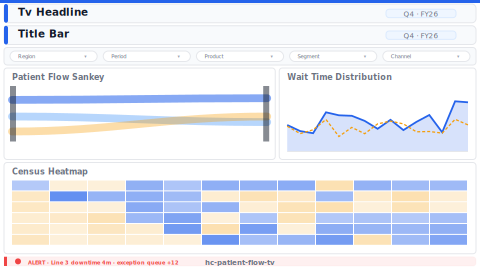

# Patient Flow (TV Wall 1080p)

> **Preview:**  · variants: [annotated](../../assets/layout-previews/hc-patient-flow-tv-annotated.svg) · [dark](../../assets/layout-previews/hc-patient-flow-tv-dark.svg)

> **Derived layout** — TV-wall variant of [`hc-patient-flow`](./hc-patient-flow.md).

- Canvas: `1920×1080` (tv-wall-1080p)
- Visuals: 9
- Zones: `tv-headline, title-bar, slicer-row, patient-flow-sankey, wait-time-distribution, census-heatmap, tv-alert-ticker`
- Use when: Always-on wall-mounted variant of `hc-patient-flow`. Read-only, 1080p TV.
- Avoid when: Handheld / desktop use — TV variants use oversized type that looks wrong up close.

See the base recipe [`hc-patient-flow.md`](./hc-patient-flow.md) for full narrative.
