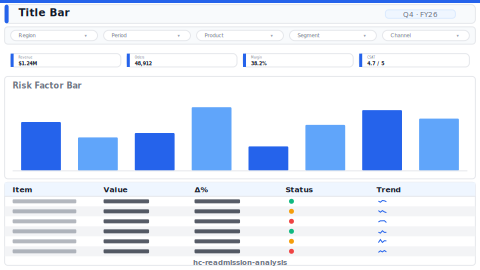

# Readmission Analysis

> **Preview:**  · variants: [annotated](../../assets/layout-previews/hc-readmission-analysis-annotated.svg) · [dark](../../assets/layout-previews/hc-readmission-analysis-dark.svg)

- Canvas: `1664×936` (landscape-16x9)
- Style: `analytical` · Domain: `healthcare`
- Visuals: 7
- Zones: `title-bar, slicer-row, readmission-rate-kpis, risk-factor-bar, cohort-compare-line`

## Use when
30/60/90-day readmission rates with risk factors and cohort comparison

## Avoid when
Small-volume specialties (n < 50 discharges/month)

## Recommended themes
`healthcare-pharma`, `accessible-okabe-ito`, `public-sector-gov`

## Chart patterns
`kpi-card-with-spark`, `ranking-bar`, `cohort-line`

## Data requirements
- min_rows: 500
- required_measures: `readmit_rate`
- required_dimensions: `diagnosis`, `cohort`
- date_grain: `month`

See `layouts-index.json` for full machine-readable entry including `zones_detail[]`.
