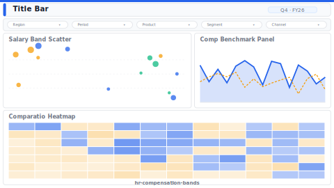

# Compensation Bands & Comparatio

> **Preview:**  · variants: [annotated](../../assets/layout-previews/hr-compensation-bands-annotated.svg) · [dark](../../assets/layout-previews/hr-compensation-bands-dark.svg)

- Canvas: `1664×936` (landscape-16x9)
- Style: `analytical` · Domain: `hr`
- Visuals: 6
- Zones: `title-bar, slicer-row, salary-band-scatter, comp-benchmark-panel, comparatio-heatmap`

## Use when
Comp review cycle — salary-band scatter vs market median with comparatio distribution

## Avoid when
When market-data benchmarks aren't licensed or job architecture isn't defined

## Recommended themes
`hr-people-analytics`, `consulting-authority`, `corporate-financial`

## Chart patterns
`scatter-plot`, `benchmark-band`, `matrix-heat`

## Data requirements
- min_rows: 100
- required_measures: `base_salary`, `market_median`
- required_dimensions: `job_level`, `function`
- date_grain: `year`

See `layouts-index.json` for full machine-readable entry including `zones_detail[]`.
