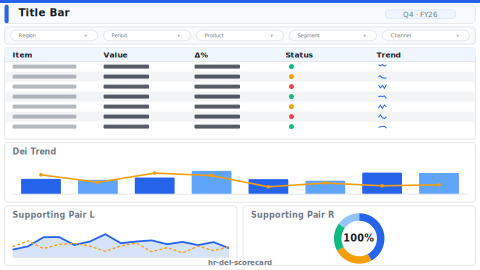

# DE&I Scorecard

> **Preview:**  · variants: [annotated](../../assets/layout-previews/hr-dei-scorecard-annotated.svg) · [dark](../../assets/layout-previews/hr-dei-scorecard-dark.svg)

- Canvas: `1664×936` (landscape-16x9)
- Style: `executive` · Domain: `hr`
- Visuals: 7
- Zones: `title-bar, dei-rep-filter, dei-representation-grid, dei-trend, supporting-pair`

## Use when
DE&I annual / quarterly report; representation by level + geography with trend

## Avoid when
Where local regulation prohibits storing protected attributes in BI

## Recommended themes
`accessible-okabe-ito`, `sustainability-esg`, `public-sector-gov`, `hr-people-analytics`

## Chart patterns
`stacked-bar`, `matrix-heat`, `trend-mini`

## Data requirements
- min_rows: 50
- required_measures: `representation_pct`
- required_dimensions: `level`, `dimension`
- date_grain: `quarter`

See `layouts-index.json` for full machine-readable entry including `zones_detail[]`.
