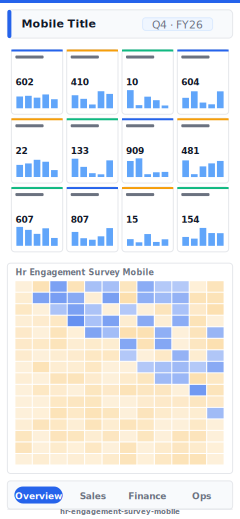

# Engagement Survey (eNPS) (Mobile)

> **Preview:**  · variants: [annotated](../../assets/layout-previews/hr-engagement-survey-mobile-annotated.svg) · [dark](../../assets/layout-previews/hr-engagement-survey-mobile-dark.svg)

> **Derived layout** — Mobile portrait variant of [`hr-engagement-survey`](./hr-engagement-survey.md).

- Canvas: `390×844` (mobile-portrait)
- Visuals: 4
- Zones: `mobile-title, mobile-chip-row, mobile-hero, mobile-nav-tabs`
- Use when: Mobile / phone variant of `hr-engagement-survey`. Same insight, stacked single-column layout.
- Avoid when: Desktop screens — prefer the parent landscape layout.

See the base recipe [`hr-engagement-survey.md`](./hr-engagement-survey.md) for full narrative.
