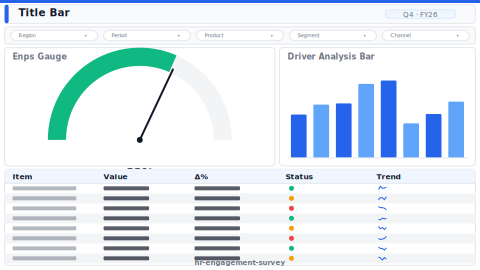

# Engagement Survey (eNPS)

> **Preview:**  · variants: [annotated](../../assets/layout-previews/hr-engagement-survey-annotated.svg) · [dark](../../assets/layout-previews/hr-engagement-survey-dark.svg)

- Canvas: `1664×936` (landscape-16x9)
- Style: `analytical` · Domain: `hr`
- Visuals: 6
- Zones: `title-bar, slicer-row, enps-gauge, driver-analysis-bar, comment-theme-cloud`

## Use when
Post-survey readout — eNPS headline, driver analysis, comment theme clusters

## Avoid when
When survey n < 30 within a segment (confidentiality risk)

## Recommended themes
`hr-people-analytics`, `education-edtech`, `sustainability-esg`

## Chart patterns
`gauge`, `ranking-bar`, `word-cloud`

## Data requirements
- min_rows: 500
- required_measures: `enps`, `favorable_pct`
- required_dimensions: `question`, `segment`
- date_grain: `quarter`

See `layouts-index.json` for full machine-readable entry including `zones_detail[]`.
