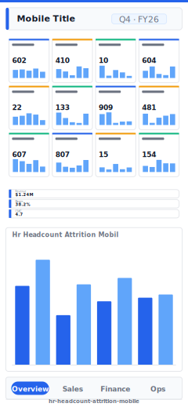

# HR Headcount & Attrition (Mobile)

> **Preview:**  · variants: [annotated](../../assets/layout-previews/hr-headcount-attrition-mobile-annotated.svg) · [dark](../../assets/layout-previews/hr-headcount-attrition-mobile-dark.svg)

> **Derived layout** — Mobile portrait variant of [`hr-headcount-attrition`](./hr-headcount-attrition.md).

- Canvas: `390×844` (mobile-portrait)
- Visuals: 5
- Zones: `mobile-title, mobile-chip-row, mobile-kpi-stack, mobile-hero, mobile-nav-tabs`
- Use when: Mobile / phone variant of `hr-headcount-attrition`. Same insight, stacked single-column layout.
- Avoid when: Desktop screens — prefer the parent landscape layout.

See the base recipe [`hr-headcount-attrition.md`](./hr-headcount-attrition.md) for full narrative.
